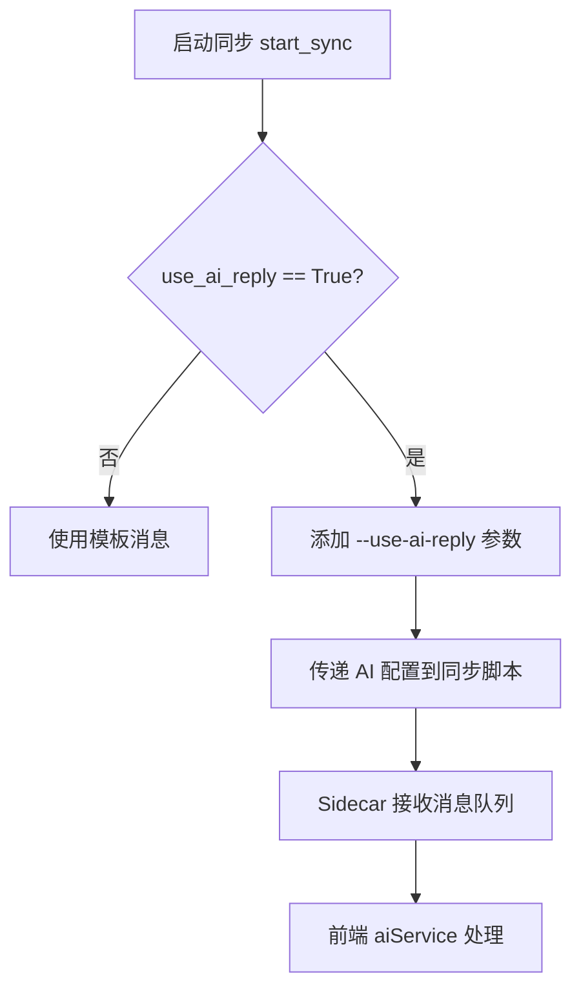
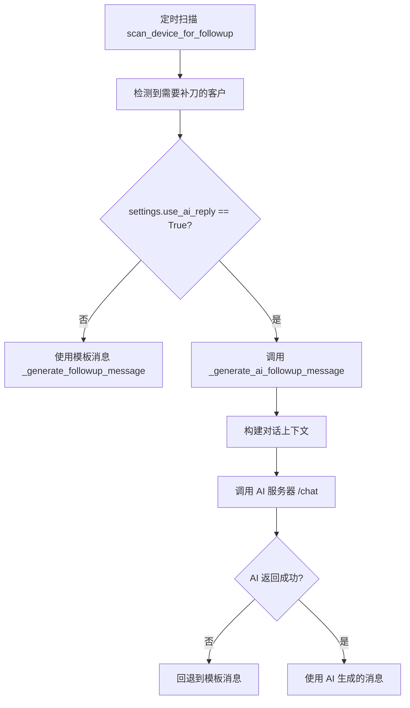

# AI 触发条件与 Prompt 拼接逻辑分析

> 文档创建时间: 2026-01-18  
> 目的: 详细分析系统中 AI 回复功能的触发条件、Prompt 拼接逻辑以及传递的内容

---

## 目录

1. [概述](#概述)
2. [AI 触发条件](#ai-触发条件)
3. [Prompt 拼接逻辑](#prompt-拼接逻辑)
4. [传递内容详解](#传递内容详解)
5. [数据流图](#数据流图)
6. [配置项说明](#配置项说明)

---

## 概述

系统中的 AI 回复功能主要应用于两个场景：

| 场景                     | 模块                                 | 触发方式                 |
| ------------------------ | ------------------------------------ | ------------------------ |
| **全量同步** (Full Sync) | `device_manager.py` + `aiService.ts` | 同步过程中自动生成回复   |
| **补刀系统** (Follow-up) | `scanner.py`                         | 定时扫描触发生成跟进消息 |

---

## AI 触发条件

### 1. 全量同步场景

**触发位置**: `wecom-desktop/backend/services/device_manager.py`

**触发条件链**:



**关键代码** (`device_manager.py:554-565`):

```python
# AI Reply settings
if use_ai_reply:
    cmd.append("--use-ai-reply")
    cmd.extend(["--ai-server-url", ai_server_url])
    cmd.extend(["--ai-reply-timeout", str(ai_reply_timeout)])
    if system_prompt:
        await self._broadcast_log(serial, "INFO", f"[AI] 系统提示词已配置 ({len(system_prompt)}字符)")
        # 使用 base64 编码安全传递多行提示词
        import base64
        encoded_prompt = base64.b64encode(system_prompt.encode('utf-8')).decode('ascii')
        cmd.extend(["--system-prompt-b64", encoded_prompt])
```

**前置条件**:

- `settings.useAIReply == true` (设置页面开关)
- `settings.aiServerUrl` 已配置
- `serial` (设备序列号) 存在

---

### 2. 补刀系统场景

**触发位置**: `wecom-desktop/backend/servic../03-impl-and-arch/scanner.py`

**触发条件链**:



**关键代码** (`scanner.py:768-779`):

```python
# Generate follow-up message (AI or template based on settings)
if settings.use_ai_reply:
    self._logger.info(f"[{serial}]   Generating AI follow-up message...")
    # 获取对话消息用于 AI 上下文
    tree = await wecom.adb.get_ui_tree()
    messages = wecom.ui_parser.extract_conversation_messages(tree) if tree else []
    msg_text = await self._generate_ai_followup_message(user_name, messages, serial, attempt_number)
    if not msg_text:
        self._logger.warning(f"[{serial}]   AI generation failed, falling back to template")
        msg_text = self._generate_followup_message(attempt_number)
else:
    msg_text = self._generate_followup_message(attempt_number)
```

**前置条件**:

- 满足补刀时间条件（冷却期已过）
- 未达到最大补刀次数
- 最后一条消息是客服发送的
- `settings.use_ai_reply == True`

---

## Prompt 拼接逻辑

### 1. 前端 Prompt 拼接 (aiService.ts)

**文件位置**: `wecom-desktop/src/services/aiService.ts`

#### 1.1 对话上下文格式化

```typescript
formatConversationContext(
    conversationHistory: Array<{ content: string; is_from_kefu: boolean }>,
    currentMessage: string,
    maxLength: number = 800
): string
```

**输出格式**:

```
[CONTEXT]
AGENT: 您好，请问有什么可以帮您？
STREAMER: 我想了解一下产品价格
AGENT: 好的，我来给您介绍一下

[LATEST MESSAGE]
价格多少钱？
```

**角色映射**:

- `AGENT`: 客服 (kefu) 发送的消息 (`is_from_kefu = true`)
- `STREAMER`: 客户发送的消息 (`is_from_kefu = false`)

#### 1.2 最终输入格式化

**当有 System Prompt 时**:

```
system_prompt: {系统提示词}
user_prompt: [CONTEXT]
{对话上下文}

[LATEST MESSAGE]
{当前消息}
```

**长度限制**:

- 对话上下文部分: 最大 800 字符
- 最终输入: 最大 1000 字符（超出会截断）

#### 1.3 截断逻辑

```typescript
truncateFinalInput(input: string, maxLength: number = 1000): string
```

**截断策略**:

1. 如果检测到 `system_prompt:` 格式，优先保留 system_prompt 和最新消息
2. 从 user_prompt 部分的开头截断（去掉旧消息）
3. 兜底策略：保留开头 30%，保留结尾 70%

---

### 2. 后端 Prompt 拼接 (scanner.py)

**文件位置**: `wecom-desktop/backend/servic../03-impl-and-arch/scanner.py`

**方法**: `_generate_ai_followup_message`

#### 2.1 组合系统提示词

```python
from services.settings import get_settings_service
settings_service = get_settings_service()
system_prompt = settings_service.get_combined_system_prompt()
```

**组合逻辑** (`service.py:289-315`):

```python
def get_combined_system_prompt(self) -> str:
    """获取组合后的系统提示词（自定义提示词 + 预设风格 + 长度限制）"""
    custom_prompt = self.get_system_prompt()           # 用户自定义提示词
    preset_key = self.get("prompt_style_key", "none")   # 预设风格 key
    max_length = self.get("reply_max_length", 50)       # 回复长度限制

    # 查找预设风格
    preset = next((p for p in PROMPT_STYLE_PRESETS if p["key"] == preset_key), None)
    style_prompt = preset["prompt"] if preset else ""

    # 组合：自定义提示词 + 预设风格
    if custom_prompt and style_prompt:
        base_prompt = f"{custom_prompt}\n\n{style_prompt}"
    else:
        base_prompt = custom_prompt or style_prompt

    # 添加长度限制指令（如果没有手动设置）
    if not re.search(r'将?回复控制在\s*\d+\s*字', base_prompt):
        base_prompt += f"\n\n将回复控制在 {max_length} 字以内。"

    return base_prompt
```

#### 2.2 补刀场景 Prompt 模板

```python
user_prompt = f"""请根据对话上下文生成一条合适的跟进消息。

[对话上下文]
{context}

[跟进次数]
这是第 {attempt_number} 次跟进

要求：
1. 回复要自然、礼貌
2. 根据对话内容生成个性化的跟进消息
3. 简洁明了，不要太长
4. 语气友好，不要给客户压力"""
```

#### 2.3 人工切换检测

```python
human_detection = (
    "If the user wants to switch to human operation, human agent, or manual service, "
    "directly return ONLY the text 'command back to user operation' without any other text."
)

enhanced_system_prompt = f"{system_prompt}\n\n{human_detection}"
```

#### 2.4 最终请求格式

```python
final_input = f"system_prompt: {enhanced_system_prompt}\nuser_prompt: {user_prompt}"

payload = {
    "chatInput": final_input,
    "sessionId": f"followup_{user_name}_{device_serial}",
    "username": "followup_system",
    "message_type": "text",
    "metadata": {
        "source": "followup_scanner",
        "serial": device_serial,
        "customer": user_name,
        "attempt_number": attempt_number
    }
}
```

---

## 传递内容详解

### 1. AI 服务器请求 Payload

| 字段           | 类型   | 说明                                                | 示例                                     |
| -------------- | ------ | --------------------------------------------------- | ---------------------------------------- |
| `chatInput`    | string | 完整的输入内容（包含 system_prompt 和 user_prompt） | `"system_prompt: ...\nuser_prompt: ..."` |
| `sessionId`    | string | 会话标识符，用于上下文保持                          | `"sidecar_abc123_1705584423000"`         |
| `username`     | string | 用户标识                                            | `"sidecar_abc123"`                       |
| `message_type` | string | 消息类型，固定为 "text"                             | `"text"`                                 |
| `metadata`     | object | 元数据                                              | `{source, serial, timestamp}`            |

### 2. 对话上下文内容

| 字段       | 来源                                 | 说明                       |
| ---------- | ------------------------------------ | -------------------------- |
| 消息内容   | `conversationHistory[].content`      | 消息文本                   |
| 发送者角色 | `conversationHistory[].is_from_kefu` | 判断是 AGENT 还是 STREAMER |
| 历史窗口   | `settings.historyWindow` (默认 10)   | 最多包含多少条历史消息     |

### 3. 系统提示词组成

```
┌─────────────────────────────────────────────────┐
│                系统提示词 (system_prompt)         │
├─────────────────────────────────────────────────┤
│ 1. 用户自定义提示词                               │
│    - 来源: settings.ai_config.json               │
│    - 例: "将TT老师换为沈老师..."                   │
├─────────────────────────────────────────────────┤
│ 2. 预设风格提示词                                 │
│    - 来源: PROMPT_STYLE_PRESETS[preset_key]      │
│    - 例: "语气礼貌大方，使用"您"称呼用户..."        │
├─────────────────────────────────────────────────┤
│ 3. 回复长度限制                                   │
│    - 来源: settings.reply_max_length             │
│    - 例: "将回复控制在 65 字以内。"                │
├─────────────────────────────────────────────────┤
│ 4. 人工切换检测指令 (补刀场景)                     │
│    - 固定文本，检测用户是否要求人工服务              │
└─────────────────────────────────────────────────┘
```

---

## 数据流图

### 全量同步 AI 流程

```
┌────────────┐    ┌────────────────┐    ┌─────────────────┐
│  前端设置   │───▶│ device_manager │───▶│ initial_sync_v2 │
│ useAIReply │    │   启动同步      │    │   Python脚本    │
└────────────┘    └────────────────┘    └─────────────────┘
                                                 │
                                                 ▼
┌────────────┐    ┌────────────────┐    ┌─────────────────┐
│  AI 服务器  │◀───│   Sidecar      │◀───│  消息队列       │
│  /chat     │    │   前端界面     │    │  等待处理       │
└────────────┘    └────────────────┘    └─────────────────┘
       │                  │
       ▼                  ▼
┌────────────┐    ┌────────────────┐
│  AI 回复   │───▶│  操作员审核    │
└────────────┘    │  倒计时发送    │
                  └────────────────┘
```

### 补刀系统 AI 流程

```
┌────────────┐    ┌────────────────┐    ┌─────────────────┐
│  定时任务   │───▶│ FollowupScanner│───▶│ find_candidates │
│  Scheduler │    │   扫描设备      │    │  查找候选客户    │
└────────────┘    └────────────────┘    └─────────────────┘
                                                 │
                                                 ▼
┌────────────┐    ┌────────────────┐    ┌─────────────────┐
│  AI 服务器  │◀───│ 构建 Prompt    │◀───│ 获取对话上下文   │
│  /chat     │    │ + System Prompt│    │  extract_messages│
└────────────┘    └────────────────┘    └─────────────────┘
       │
       ▼
┌──────────────────┐
│ 发送补刀消息      │
│ send_message()   │
└──────────────────┘
```

---

## 配置项说明

### 设置存储位置

| 配置项             | 存储位置                        | 说明                 |
| ------------------ | ------------------------------- | -------------------- |
| `system_prompt`    | SQLite 数据库 (`ai_reply` 类别) | 用户自定义系统提示词 |
| `prompt_style_key` | SQLite 数据库 (`ai_reply` 类别) | 预设风格选择         |
| `history_window`   | `settings/ai_config.json`       | 对话历史窗口大小     |
| `auto_learn`       | `settings/ai_config.json`       | 自动学习配置         |
| `use_ai_reply`     | SQLite 数据库 (`ai_reply` 类别) | AI 回复开关          |
| `ai_server_url`    | SQLite 数据库 (`ai_reply` 类别) | AI 服务器地址        |
| `ai_reply_timeout` | SQLite 数据库 (`ai_reply` 类别) | AI 请求超时时间      |
| `reply_max_length` | SQLite 数据库 (`ai_reply` 类别) | 回复最大长度         |

### 预设风格列表

| Key            | 名称          | 描述                 |
| -------------- | ------------- | -------------------- |
| `none`         | 无预设        | 不使用预设风格       |
| `default`      | 默认风格      | 礼貌大方，有条理     |
| `lively`       | 活泼风格      | 热情活泼，像朋友一样 |
| `professional` | 专业风格      | 正式商务用语         |
| `minimal`      | 极简/高效风格 | 直接高效，不寒暄     |

---

## 示例：完整的 AI 请求

### 示例 1: 全量同步场景

**输入 (chatInput)**:

```
system_prompt: 将TT老师换为沈老师
在回答时倾向于要照片，但要照片要注意上下文场景

语气礼貌大方，使用"您"称呼用户。
回答要直接且有条理，避免冗长。
始终保持耐心，无论用户的情绪如何。

将回复控制在 65 字以内。
user_prompt: [CONTEXT]
STREAMER: 你好
AGENT: 您好，请问有什么可以帮您？
STREAMER: 我想了解一下课程

[LATEST MESSAGE]
价格多少钱？
```

### 示例 2: 补刀场景

**输入 (chatInput)**:

```
system_prompt: 将TT老师换为沈老师...

If the user wants to switch to human operation, human agent, or manual service,
directly return ONLY the text 'command back to user operation' without any other text.
user_prompt: 请根据对话上下文生成一条合适的跟进消息。

[对话上下文]
AGENT: 您好，请问有什么可以帮您？
CUSTOMER: 我考虑考虑
AGENT: 好的，有问题随时联系我

[跟进次数]
这是第 2 次跟进

要求：
1. 回复要自然、礼貌
2. 根据对话内容生成个性化的跟进消息
3. 简洁明了，不要太长
4. 语气友好，不要给客户压力
```

---

## 总结

1. **触发条件核心判断**: `use_ai_reply` 设置开关
2. **Prompt 组成**: `system_prompt` (自定义 + 预设 + 长度限制) + `user_prompt` (上下文 + 当前消息)
3. **上下文格式**: `[CONTEXT]` 区域包含角色标注的历史消息，`[LATEST MESSAGE]` 区域包含当前待回复消息
4. **长度限制**: 上下文最大 800 字符，整体输入最大 1000 字符
5. **特殊处理**: 补刀场景会添加人工切换检测指令
