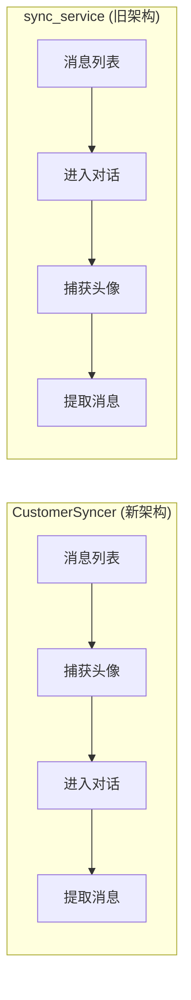

# 头像获取时机分析

**创建日期**: 2026-01-18  
**文档类型**: 架构分析

## 概述

系统中存在 **两套头像捕获实现**，它们在不同的时机和场景下被调用。

---

## 实现对比

| 特性     | CustomerSyncer (新架构) | sync_service (旧架构)               |
| -------- | ----------------------- | ----------------------------------- |
| 入口     | `CustomerSyncer.sync()` | `sync_service._sync_one_customer()` |
| 头像管理 | `AvatarManager`         | 内置方法                            |
| 捕获时机 | 进入对话 **之前**       | 进入对话 **之后**                   |
| 滚动策略 | 3次尝试                 | 10次尝试                            |

---

## 时机 1: CustomerSyncer (新架构)

### 调用位置

```
CustomerSyncer.sync()
    ├── 1. 获取或创建客户记录
    ├── 2. 处理头像  ← 在这里捕获
    │       └── _try_capture_avatar(user_name)
    │               └── AvatarManager.capture_if_needed(name)
    ├── 3. 进入对话
    ├── 4. 提取历史消息
    └── ...
```

### 代码位置

**文件**: `services/sync/customer_syncer.py` 第 147-149 行

```python
async def sync(self, user, options, kefu_id, device_serial):
    # ...
    # 1. 获取或创建客户记录
    customer = self._repository.get_or_create_customer(...)

    # 2. 处理头像  ← 头像捕获发生在这里
    if self._avatar_manager:
        await self._try_capture_avatar(user_name)

    # 3. 进入对话
    if not await self._enter_conversation(user_name, user_channel):
        # ...
```

### 问题：当前屏幕是什么？

在 CustomerSyncer 中，头像捕获发生在 **进入对话之前**。

此时屏幕显示的是 **消息列表页面**，而不是对话页面。

```
┌─────────────────────────────┐
│  消息列表页面                 │
├─────────────────────────────┤
│ [头像] 张三   @微信          │  ← 当前可能在这里
│        最新消息... 12:30    │
├─────────────────────────────┤
│ [头像] 李四   @微信          │
│        你好     11:20       │
├─────────────────────────────┤
│ [头像] 王五   @企微          │
│        ...                  │
└─────────────────────────────┘
```

**这意味着**：

- `AvatarManager._find_avatar_in_tree()` 需要在消息列表页面查找头像
- 查找逻辑是通过用户名定位，然后找同一行的头像
- 但消息列表的 UI 结构与对话页面不同！

---

## 时机 2: sync_service (旧架构)

### 调用位置

```
sync_service._sync_one_customer()
    ├── 1. 点击用户进入对话  ← 先进入对话
    ├── 2. 等待加载
    ├── 3. 捕获头像  ← 在对话页面里捕获
    │       └── _capture_avatar_with_scroll(user.name)
    │               └── _try_capture_avatar_once(user_name)
    │                       └── _find_avatar_in_header(tree)
    ├── 4. 提取历史消息
    └── ...
```

### 代码位置

**文件**: `services/sync_service.py` 第 2150-2157 行

```python
async def _sync_one_customer(self, user, ...):
    # 点击用户进入对话
    success = await self.wecom.click_user_in_list(user.name, user.channel)
    # ...
    await self._human_delay("tap")

    # 头像捕获发生在进入对话之后！
    if not self._is_avatar_cached(user.name):
        avatar_path = await self._capture_avatar_with_scroll(user.name, max_scroll_attempts=10)
    # ...
```

### 当前屏幕是什么？

在 sync_service 中，头像捕获发生在 **进入对话之后**。

此时屏幕显示的是 **对话页面**：

```
┌─────────────────────────────┐
│  ← 张三                      │  ← 标题栏（可能有头像）
├─────────────────────────────┤
│ [头像] 你好                  │  ← 对方消息（左侧有头像）
│                             │
│              好的 [我的头像] │  ← 自己发的消息
│                             │
│ [头像] 好的，明天见          │  ← 对方消息
├─────────────────────────────┤
│ [输入框]              [发送] │
└─────────────────────────────┘
```

**这意味着**：

- `_find_avatar_in_header()` 查找的是对话页面中左侧消息的头像
- 需要有对方发送的消息（左侧消息）才能找到头像
- 如果只有自己发的消息，则找不到头像

---

## 两种时机的对比



| 时机                        | 优点                   | 缺点                         |
| --------------------------- | ---------------------- | ---------------------------- |
| 进入对话前 (CustomerSyncer) | 不会因滚动丢失头像位置 | 消息列表 UI 不一定有头像     |
| 进入对话后 (sync_service)   | 对话页面头像更清晰     | 可能需要滚动才能看到对方消息 |

---

## 问题分析

### 问题 1: UI 上下文不匹配

`AvatarManager._find_avatar_in_tree()` 的逻辑是：

1. 查找用户名文本节点
2. 在同一行查找头像图标

但这个逻辑假设屏幕上有用户名和头像并排显示。

- **在消息列表页面**：用户名可能没有头像（只有简短预览）
- **在对话页面**：用户名在标题栏，头像在消息气泡旁边

### 问题 2: CustomerSyncer 的时机错误

当前 CustomerSyncer 在 **进入对话之前** 就尝试捕获头像。

此时屏幕还是消息列表，用户的对话还没打开，**根本看不到对话中的头像**。

### 推荐修复

将 CustomerSyncer 的头像捕获时机移到 **进入对话之后**：

```python
async def sync(self, user, options, kefu_id, device_serial):
    # 1. 获取或创建客户记录
    customer = self._repository.get_or_create_customer(...)

    # 2. 进入对话  ← 先进入
    if not await self._enter_conversation(user_name, user_channel):
        # ...
        return result

    # 3. 处理头像  ← 进入对话后再捕获
    if self._avatar_manager:
        await self._try_capture_avatar(user_name)

    # 4. 提取历史消息
    messages = await self._extract_messages()
```

---

## 相关文件

| 文件                               | 说明                             |
| ---------------------------------- | -------------------------------- |
| `services/sync/customer_syncer.py` | CustomerSyncer 同步逻辑 (新架构) |
| `services/sync_service.py`         | sync_service 同步逻辑 (旧架构)   |
| `services/user/avatar.py`          | AvatarManager 头像管理器         |
| `services/sync/factory.py`         | 同步组件工厂，创建 AvatarManager |

---

## 总结

1. **当前问题**: CustomerSyncer 在错误的时机（进入对话前）尝试捕获头像
2. **根本原因**: 进入对话前屏幕显示的是消息列表，没有可供捕获的头像
3. **建议修复**: 将头像捕获移到进入对话之后，与 sync_service 的做法一致
