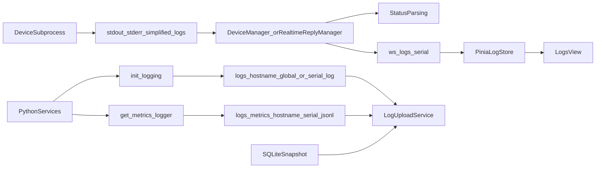

# Android_run_test 当前日志结构分析

## 概述

`android_run_test` 当前实现的“日志系统”主要是应用层运行日志体系，而不是 Android OS 层的系统日志采集链路。

从现行代码看，日志可以分为 4 条主线：

1. 运行日志：落盘到项目根目录 `logs/`
2. 指标日志：落盘到 `logs/metrics/`，采用 JSON Lines
3. 实时日志流：子进程输出经后端解析后，通过 WebSocket 推给前端
4. 上传归档：后端定时收集日志文件和数据库快照并上传到数据平台

当前代码中没有发现以下 Android 原生日志采集实现：

- `adb logcat`
- `bugreport`
- ANR / tombstone 收集
- systrace / perfetto

因此，这里的“系统日志”更准确地说是 WeCom 自动化系统自身的运行日志和业务指标日志。

## 当前日志目录

```text
android_run_test/
├── logs/
│   ├── {hostname}-global.log
│   ├── {hostname}-{serial}.log
│   ├── {hostname}-global.YYYY-MM-DD_*.log
│   ├── {hostname}-{serial}.YYYY-MM-DD_*.log
│   └── metrics/
│       ├── {hostname}-{serial}.jsonl
│       └── {hostname}-{serial}.YYYY-MM-DD_*.jsonl
└── wecom-desktop/
    └── logs/
        ├── backend.dev.log
        └── frontend.dev.log
```

需要区分两类目录：

- 根目录 `logs/`：系统正式运行日志，来自 Python 主进程和设备子进程
- `wecom-desktop/logs/`：开发脚本 `redeploy-dev.sh` 产生的前后端开发日志，不属于业务运行主链路

## 一、运行日志

### 1.1 生成位置

运行日志的统一入口是 `src/wecom_automation/core/logging.py` 中的 `init_logging()` 与 `get_logger()`。

- 主进程模式：`init_logging(..., serial=None)`
- 子进程模式：`init_logging(..., serial=<device_serial>)`

日志库使用 `loguru`，并通过 `enqueue=True`、按设备分文件的方式规避 Windows 多进程写同一文件的冲突。

### 1.2 命名规则

- 主进程日志：`logs/{hostname}-global.log`
- 设备子进程日志：`logs/{hostname}-{serial}.log`

这里的 `hostname` 不是操作系统原始主机名，而是通过设置服务读取并清洗后的逻辑主机名：

- 空值回退为 `default`
- `/`、`\`、空格会被替换

### 1.3 轮转与保留

- 轮转时间：`00:00`
- 保留时间：`30 days`
- 编码：`utf-8`

### 1.4 文件内容格式

文件日志采用详细文本格式：

```text
YYYY-MM-DD HH:mm:ss | LEVEL | module:function:line | message
```

样例可见根目录现有日志文件，例如：

```text
2026-03-18 13:25:17 | INFO     | wecom_automation.core.logging:log_operation:325 | Starting: send_message
2026-03-18 13:25:25 | INFO     | wecom_automation.services.wecom_service:send_message:2162 | Message sent successfully
```

### 1.5 主进程与子进程职责

- 主进程只写 `{hostname}-global.log`
- 每个设备子进程只写自己的 `{hostname}-{serial}.log`

这意味着：

- 全局日志主要承载后端主服务、调度、控制类信息
- 设备日志承载该设备同步、跟进、发送消息等具体操作日志

## 二、指标日志

### 2.1 存储位置

指标日志由 `src/wecom_automation/core/metrics_logger.py` 负责写入：

- 路径：`logs/metrics/{hostname}-{serial}.jsonl`

### 2.2 格式

指标日志是 JSON Lines，每行一条独立 JSON 事件，不和普通文本日志混写。

基础字段结构如下：

```json
{
  "timestamp": "2026-03-18T00:00:00.071795",
  "level": "METRIC",
  "event": "session_summary",
  "session_id": "253b1314",
  "device_serial": "3051952034005QC",
  "data": {
    "duration_seconds": 16137.254938,
    "total_messages": 0
  }
}
```

### 2.3 事件类型

从当前实现可见的核心事件包括：

- `message_received`
- `message_processed`
- `ai_reply_generated`
- `reply_sent`
- `customer_updated`
- `blacklist_added`
- `user_deleted`
- `conversation_context`
- `session_summary`
- `error_occurred`

### 2.4 作用

这类日志主要用于：

- 会话统计
- 回复发送结果分析
- 黑名单与用户删除检测记录
- 会话上下文快照留痕
- 后续上传到数据平台做集中分析

它不是面向人肉排错的详细文本日志，而是面向统计与后处理的结构化事件流。

## 三、实时日志流

### 3.1 来源

前端看到的“实时日志”不是直接 tail 文件，而是来自设备子进程 `stdout/stderr`。

两个核心脚本：

- `wecom-desktop/backend/scripts/initial_sync.py`
- `wecom-desktop/backend/scripts/realtime_reply_process.py`

它们都会：

1. 调用 `init_logging(hostname=..., console=False, serial=serial)` 写设备文件日志
2. 额外手动向 `sys.stdout` 增加一个简化输出 sink

stdout 简化格式为：

```text
HH:MM:SS | LEVEL | message
```

例如：

```text
14:32:15 | INFO     | Starting sync for device R58M35XXXX
14:32:20 | ERROR    | Failed to extract message: timeout
```

### 3.2 后端解析

后端由以下服务读取子进程输出：

- `wecom-desktop/backend/services/device_manager.py`
- `wecom-desktop/backend/services/realtime_reply_manager.py`

解析行为包括：

- 从 `stdout` / `stderr` 逐行读取
- 优先按 `utf-8` 解码
- Windows 下回退尝试 `gbk` / `cp936`
- 用正则解析 `HH:MM:SS | LEVEL | message`
- 提取 `level`
- 保留正文 `message`

如果无法匹配该格式，则默认按普通文本处理并赋予 `INFO` 级别。

### 3.3 推送协议

后端 WebSocket 路由位于 `wecom-desktop/backend/routers/logs.py`：

- `ws://localhost:8765/ws/logs/{serial}`

除 JSON 日志条目外，链路上还存在 **应用层文本心跳**：客户端周期性发送 `ping`，服务端回复 `pong`（二者均不入库到可见日志列表）。服务端在长时间无上行时可能向下游发送一次文本 `ping` 作为**写通道探活**；前端 store 将其视为保活信号刷新本地时间戳（不展示为日志）。传输层另由 uvicorn 配置 **WebSocket Ping 帧**（与 `main.py` / `npm run backend` 中的 `--ws-ping-interval` / `--ws-ping-timeout` 一致）。详见 `logging-system-architecture.md` 中「WebSocket 可靠性与保活」与 `docs/04-bugs-and-fixes/resolved/2026-04-21-sidecar-log-stream-disconnect.md`。

推送给前端的消息结构为：

```json
{
  "timestamp": "2026-02-06T14:32:15.123456",
  "level": "INFO",
  "message": "Starting sync for device R58M35XXXX",
  "source": "sync"
}
```

`source` 当前分为：

- `sync`
- `followup`
- `system`

其中：

- `sync` 来自初始同步流程
- `followup` 来自实时跟进/自动回复流程
- `system` 主要是连接建立、断开、流状态等系统提示

### 3.4 前端接收与缓存

前端入口在 `wecom-desktop/src/stores/logs.ts`。

前端做了几层处理：

- 每设备维护一组内存日志
- 通过 `BroadcastChannel` 在多个窗口间同步
- **被动断开**（网络抖动、后端 `--reload`、代理超时等）时 **自动重连**（指数退避，有上限）；用户主动 `disconnectLogStream` 或关闭日志面板时不重连
- 使用随机 `id` 做去重管理
- 每设备最多保留 `1000` 条
- 支持按 `level`、`source`、关键字过滤
- 可导出为 `wecom-logs-{serial}-{timestamp}.txt`

日志视图在 `wecom-desktop/src/views/LogsView.vue`，支持最多 3 台设备并排查看。

## 四、上传归档

### 4.1 上传入口

上传逻辑在 `wecom-desktop/backend/services/log_upload_service.py` 与 `log_upload_client.py`。

客户端最终请求的接口是：

- `/api/android-logs/upload`

### 4.2 收集对象

上传服务会从项目目录收集以下对象：

1. 数据库快照
2. 根目录 `logs/*.log`
3. `logs/metrics/*.jsonl`

其中数据库不是直接上传线上正在写入的原始文件，而是先创建临时 SQLite 快照，再作为上传文件发送。

### 4.3 上传分类

当前代码中的 `upload_kind` 包括：

- `wecom-db`
- `metrics-jsonl`
- `runtime-log`
- `scanner-log`

分类规则如下：

- 以 `{hostname}-global.log` 为主的全局日志归为 `runtime-log`
- 设备日志归为 `scanner-log`
- 指标文件归为 `metrics-jsonl`
- 数据库快照归为 `wecom-db`

### 4.4 上传元数据

上传时还会携带：

- `device_id`
- `hostname`
- `person_name`
- `upload_kind`
- `checksum`
- `uploaded_at`

系统还会记录每个文件的 checksum、上传结果和是否已成功上传，避免重复上传相同内容。

## 五、状态派生逻辑

实时日志除了展示，还被后端拿来推导运行状态。

### 5.1 Sync 状态派生

`device_manager.py` 会根据日志文案更新：

- 同步阶段
- 进度百分比
- 当前提示语
- 已同步客户数
- 已添加消息数

这套逻辑高度依赖日志消息文本内容，例如：

- `Step 1:`
- `Getting kefu information`
- `Found X customers`
- `Processing customer X/Y`

也就是说，部分 UI 进度本质上是从日志文本中解析出来的，而不是单独的状态协议。

### 5.2 Follow-up 状态派生

`realtime_reply_manager.py` 会根据日志文案更新：

- 检测到的未读数
- 已发送回复数
- 当前状态文本
- 错误列表

例如它会识别：

- `Found X unread`
- `Reply sent`
- `sent successfully`

这说明日志在当前系统里不仅承担“记录”作用，也承担“状态事件源”的作用。

## 六、与旧文档的关系

现有仓库里与日志相关的文档并不完全处于同一时期，阅读时需要分层理解。

### 6.1 可作为当前实现依据的内容

以下内容与当前代码较一致：

- `src/wecom_automation/core/logging.py`
- `src/wecom_automation/core/metrics_logger.py`
- `wecom-desktop/backend/scripts/initial_sync.py`
- `wecom-desktop/backend/scripts/realtime_reply_process.py`
- `wecom-desktop/backend/services/device_manager.py`
- `wecom-desktop/backend/services/realtime_reply_manager.py`
- `wecom-desktop/backend/routers/logs.py`
- `wecom-desktop/backend/services/log_upload_service.py`
- `docs/04-bugs-and-fixes/resolved/2026-02-09-subprocess-global-log-fix.md`

### 6.2 需要谨慎阅读的内容

以下文档更适合视作历史说明、迁移背景或设计意图，而不是“当前实现的唯一事实来源”：

- `docs/07-appendix/log.md`
- `docs/05-changelog-and-upgrades/2026-02-06-loguru-migration-complete.md`
- `docs/03-impl-and-arch/key-modules/logging-system-architecture.md`

原因主要有三类：

1. 文档写于迁移中间阶段，存在命名变动
2. 部分示例仍引用旧的 `global.log` 或旧视图组件名
3. 某些内容描述的是设计目标，不完全等于最终落地代码

### 6.3 一个典型差异

较早迁移文档会写：

- `logs/global.log`

而当前实现已经是：

- `logs/{hostname}-global.log`

所以在阅读历史文档时，应优先以代码和现有样例文件为准。

## 七、当前日志体系的数据流



## 八、结论

从当前实现看，`android_run_test` 的日志系统已经形成了比较完整的闭环：

- 主进程和设备子进程分离写日志
- 指标日志与运行日志分流
- 子进程 stdout 作为实时日志事件源
- 后端根据日志派生运行状态
- 前端通过 WebSocket 做实时展示与导出
- 后端再把日志和数据库快照上传到数据平台

但它仍然是“应用运行日志体系”，不是 Android 系统级日志采集系统。

如果后续需要真正分析 Android 系统层异常，还需要额外引入 `adb logcat`、ANR、crash dump 或 bugreport 采集链路。
