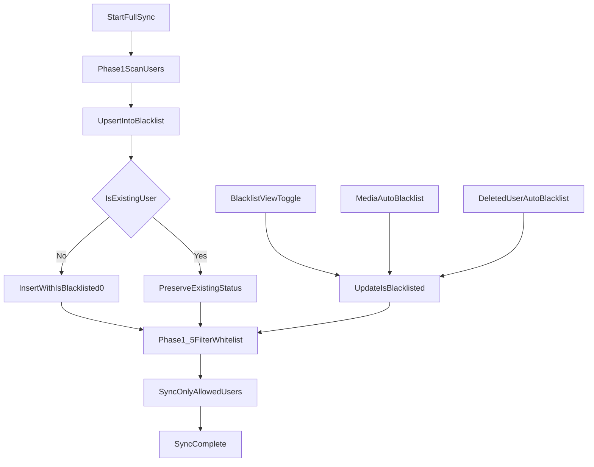

# 设备用户全量管理与黑名单系统

## 概述

当前实现复用 `blacklist` 表作为“设备扫描用户索引 + 黑名单状态表”，并由统一的
`src/wecom_automation/services/blacklist_service.py` 提供读写能力。

这份文档描述的是**当前运行时行为**，不是早期“默认拉黑所有新扫描用户”的设计草案。

## 当前策略

1. 全量同步 Phase 1 会把扫描到的用户 upsert 到 `blacklist` 表。
2. **新扫描用户默认放行**，即显式写入 `is_blacklisted=0`。
3. 已存在用户只刷新元数据，保留之前的拉黑/放行决定。
4. Phase 1.5 仅同步 `is_blacklisted=0` 的用户。
5. 用户可在黑名单管理页手动切换状态；媒体自动拉黑、删好友自动拉黑也会把状态更新为 `1`。

## 工作流



## 状态语义

- `is_blacklisted=1`：拉黑，运行时跳过。
- `is_blacklisted=0`：放行，允许后续同步或跟进处理。

在界面上：

- 勾选：拉黑。
- 未勾选：放行。

“默认状态”只适用于**历史黑名单数据迁移**，不适用于**新扫描用户**。历史记录在 schema repair/migration 中会被回填为
`is_blacklisted=1`，而 `upsert_scanned_users()` 会对新扫描用户显式写入 `0`。

## 数据模型

`blacklist` 表核心字段：

```sql
CREATE TABLE IF NOT EXISTS blacklist (
    id INTEGER PRIMARY KEY AUTOINCREMENT,
    device_serial TEXT NOT NULL,
    customer_name TEXT NOT NULL,
    customer_channel TEXT,
    reason TEXT,
    deleted_by_user BOOLEAN DEFAULT 0,
    is_blacklisted BOOLEAN DEFAULT 1,
    avatar_url TEXT,
    customer_db_id INTEGER,
    created_at TIMESTAMP DEFAULT CURRENT_TIMESTAMP,
    updated_at TIMESTAMP DEFAULT CURRENT_TIMESTAMP,
    UNIQUE(device_serial, customer_name, customer_channel)
);
```

说明：

- 列默认值仍为 `1`，用于兼容旧库和历史迁移。
- 运行时批量扫描不是依赖列默认值，而是在 `upsert_scanned_users()` 中显式写入 `is_blacklisted=0`。

## 运行时入口

### 全量同步

- `src/wecom_automation/services/sync/orchestrator.py`
- `src/wecom_automation/services/blacklist_service.py`

行为：

1. Phase 1 扫描用户。
2. 调用 `BlacklistWriter.upsert_scanned_users()` 写入或更新记录。
3. 调用 `BlacklistWriter.get_whitelist_names()` 过滤允许同步的客户。

### 黑名单管理 API

- `wecom-desktop/backend/routers/blacklist.py`

核心接口：

- `GET /api/blacklist`
- `GET /api/blacklist/customers`
- `POST /api/blacklist/upsert-scanned`
- `POST /api/blacklist/update-status`
- `POST /api/blacklist/batch-update-status`

### 自动拉黑入口

- `src/wecom_automation/services/media_actions/actions/auto_blacklist.py`
- `src/wecom_automation/services/sync/customer_syncer.py`
- `wecom-desktop/backend/services/followup/response_detector.py`

说明：

- 客户发送图片/视频时，可通过 media auto-actions 自动写入黑名单。
- 检测到“用户删除/拉黑客服”系统消息时，也会自动写入黑名单。

## 场景验证

| 场景                 | 数据库状态                | 同步行为       |
| :------------------- | :------------------------ | :------------- |
| 新用户首次扫描       | 插入 `is_blacklisted=0`   | 会被同步       |
| 用户在界面中勾选拉黑 | 更新为 `is_blacklisted=1` | 会被跳过       |
| 用户重新放行         | 更新为 `is_blacklisted=0` | 会被同步       |
| 媒体触发自动拉黑     | 更新为 `is_blacklisted=1` | 后续会被跳过   |
| 再次扫描已存在用户   | 保留原状态                | 继续遵循原选择 |

## 维护说明

- 统一实现位于 `src/wecom_automation/services/blacklist_service.py`。
- `wecom-desktop/backend/services/blacklist_service.py` 仅保留为兼容层，不应再作为新逻辑的落点。
