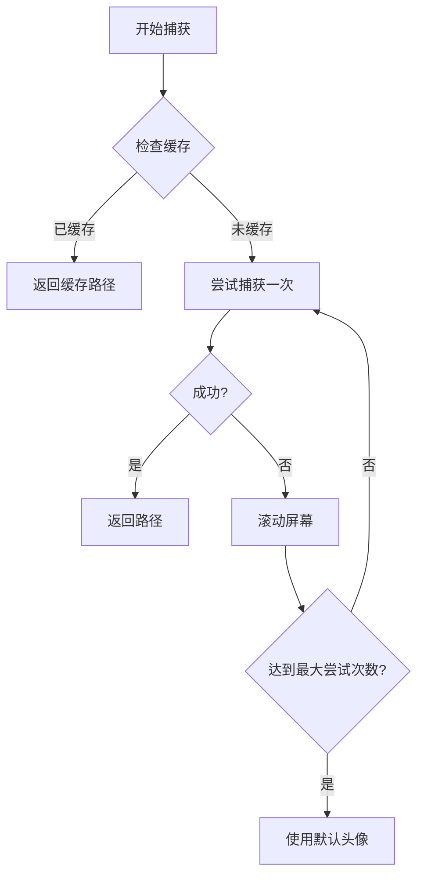

# 头像截取失败问题分析

**创建日期**: 2026-01-18  
**文档类型**: Bug 分析

## 问题描述

头像截取功能在三次尝试后仍然失败，无法捕获用户头像。

## 头像捕获流程



## 代码调用链

| 入口                    | 调用路径                                                                                              |
| ----------------------- | ----------------------------------------------------------------------------------------------------- |
| `CustomerSyncer.sync()` | `→ _try_capture_avatar()` → `AvatarManager.capture_if_needed()` → `capture()` → `_try_capture_once()` |
| `sync_service.py`       | `→ _capture_avatar_with_scroll()` → `_try_capture_avatar_once()` → `_find_avatar_in_header()`         |

存在 **两套** 头像捕获实现，可能导致行为不一致。

---

## 可能的失败原因

### 原因 1: `get_ui_tree` 方法不存在

**位置**: `avatar.py` 第 173-178 行

```python
async def _try_capture_once(self, name: str) -> Optional[Path]:
    # ...
    if not hasattr(self._wecom, 'get_ui_tree'):
        return None

    tree = await self._wecom.get_ui_tree()
    if not tree:
        return None
```

**问题**:

- `AvatarManager` 期望 `wecom_service` 有 `get_ui_tree` 方法
- 但实际上 `WeComService` 使用的是 `self.adb.get_ui_tree()`

**验证**: 检查 `WeComService` 是否有 `get_ui_tree` 方法：

```python
# WeComService 通常结构
class WeComService:
    def __init__(self):
        self.adb = ADBService()  # get_ui_tree 在这里

    # 可能没有直接暴露 get_ui_tree
```

**影响**: 如果方法不存在，直接返回 `None`，不会尝试捕获。

---

### 原因 2: 找不到用户名节点

**位置**: `avatar.py` 第 241-249 行

```python
def _find_avatar_in_tree(self, tree: Any, name: str) -> Optional[Tuple[int, int, int, int]]:
    nodes = self._collect_all_nodes(tree)

    # 首先找到用户名节点
    name_node = None
    for node in nodes:
        text = (node.get("text") or "").strip()
        if text == name:  # 精确匹配
            name_node = node
            break

    if not name_node:
        return None  # 找不到用户名则返回 None
```

**问题**:

- 使用 **精确匹配** (`text == name`)
- 如果 UI 上显示的名称与数据库中的名称不完全一致，就会匹配失败
- 例如: 数据库存储 "张三" 但 UI 显示 "张三 (备注)" 或有额外空格

**影响**: 找不到用户名节点，无法定位头像位置。

---

### 原因 3: 头像不在同一行 (Y 坐标偏移)

**位置**: `avatar.py` 第 287-291 行

```python
# 检查是否在同一行
is_same_row = abs(y1 - name_y) < 100

if is_same_row and (is_avatar_rid or (is_avatar_class and is_left_side and is_avatar_size and is_square)):
    return parsed
```

**问题**:

- 阈值 100px 可能太小，不同设备/分辨率下头像与名称的 Y 偏移可能不同
- **`name_y` 是用户名的 `y1`（顶部）**，而头像可能在名称下方或上方

**影响**: 即使头像存在，因为 Y 坐标差异超过 100px 而被跳过。

---

### 原因 4: 头像尺寸不符合预期

**位置**: `avatar.py` 第 283 行

```python
is_avatar_size = 40 <= width <= 150 and 40 <= height <= 150
```

**问题**:

- 头像尺寸硬编码为 40-150px
- 不同设备分辨率下，头像实际尺寸可能超出这个范围
- 例如高分辨率设备上头像可能超过 150px

**影响**: 符合其他条件的头像因尺寸不匹配被过滤。

---

### 原因 5: 截图方法不存在

**位置**: `avatar.py` 第 188-194 行

```python
if hasattr(self._wecom, 'screenshot_element'):
    bounds_str = f"[{avatar_bounds[0]},{avatar_bounds[1]}][{avatar_bounds[2]},{avatar_bounds[3]}]"
    await self._wecom.screenshot_element(bounds_str, str(filepath))

    if filepath.exists():
        self._logger.info(f"Avatar captured: {name}")
        return filepath
```

**问题**:

- `screenshot_element` 方法可能不存在于 `WeComService`
- 或者截图操作内部失败（ADB 命令失败、权限问题等）
- 没有 `else` 分支处理方法不存在的情况

**影响**: 找到头像位置但无法截图保存。

---

### 原因 6: `sync_service.py` 中的 `_find_avatar_in_header` 逻辑

**位置**: `sync_service.py` 第 1835-2050 行

这套逻辑更复杂，有多重过滤条件：

| 过滤条件           | 阈值                           | 潜在问题                       |
| ------------------ | ------------------------------ | ------------------------------ |
| 头像必须在屏幕左侧 | `x1 > 120` 则跳过              | 部分 UI 布局头像可能超过 120px |
| 不能在顶部导航区域 | `y1 < 250` 则跳过              | 某些对话头像可能在顶部显示     |
| 不能在底部工具栏   | `y1 > bottom_toolbar_y` 则跳过 | 工具栏检测可能不准确           |
| 头像尺寸           | 30-150px                       | 高分辨率设备可能超出范围       |
| 宽高比             | 0.7-1.3                        | 对于非正方形头像可能过滤       |
| 必须与左侧消息对齐 | Y 距离 < 80px                  | 如果没有左侧消息则失败         |
| 最低分数要求       | 40分                           | 可能达不到分数阈值             |

**关键问题**:

```python
if not left_messages:
    self.logger.debug("No left-side messages found")
    return None  # ← 如果没有找到对方发的消息，根本不会尝试查找头像
```

**影响**: 如果当前屏幕没有对方发送的消息（例如只有自己发的消息可见），头像捕获会直接失败。

---

## 日志诊断

检查以下日志输出以定位具体原因：

| 日志信息                                                     | 对应原因                           |
| ------------------------------------------------------------ | ---------------------------------- |
| `"Could not get UI tree for avatar capture"`                 | 获取 UI 树失败                     |
| `"No avatar found on current screen for {name}"`             | `_find_avatar_in_header` 返回 None |
| `"No left-side messages found"`                              | 没有对方消息，无法定位头像         |
| `"Skipping element at Y=xxx (in header/nav area)"`           | 被顶部区域过滤                     |
| `"Skipping element at Y=xxx (not aligned with any message)"` | 与消息不对齐                       |
| `"Avatar capture attempt failed: {e}"`                       | 具体异常信息                       |

---

## 解决方案建议

### 1. 修复方法调用路径

```python
# avatar.py - 兼容两种调用方式
async def _try_capture_once(self, name: str) -> Optional[Path]:
    tree = None

    # 优先使用 get_ui_tree
    if hasattr(self._wecom, 'get_ui_tree'):
        tree = await self._wecom.get_ui_tree()
    # 降级到 adb.get_ui_tree
    elif hasattr(self._wecom, 'adb') and hasattr(self._wecom.adb, 'get_ui_tree'):
        tree = await self._wecom.adb.get_ui_tree()

    if not tree:
        return None
    # ...
```

### 2. 放宽名称匹配

```python
# 使用包含匹配而不是精确匹配
for node in nodes:
    text = (node.get("text") or "").strip()
    if name in text or text in name:  # 包含匹配
        name_node = node
        break
```

### 3. 增加调试日志

在关键判断点添加详细日志，便于排查：

```python
self._logger.debug(f"Found {len(nodes)} nodes in UI tree")
self._logger.debug(f"Looking for user name: {name}")
if name_node:
    self._logger.debug(f"Found name node at bounds: {name_bounds}")
else:
    self._logger.debug("Name node not found - dumping visible texts:")
    for node in nodes[:20]:
        text = node.get("text")
        if text:
            self._logger.debug(f"  - '{text}'")
```

### 4. 统一头像捕获逻辑

当前存在两套实现：

- `AvatarManager` (avatar.py) - 简单逻辑
- `sync_service._find_avatar_in_header` - 复杂逻辑

建议统一使用一套逻辑，避免维护两份代码。

---

## 相关文件

| 文件                               | 说明                                       |
| ---------------------------------- | ------------------------------------------ |
| `services/user/avatar.py`          | `AvatarManager` 头像管理器                 |
| `services/sync_service.py`         | 同步服务中的头像捕获逻辑 (第 1657-2050 行) |
| `services/sync/customer_syncer.py` | 客户同步器，调用 `AvatarManager`           |
