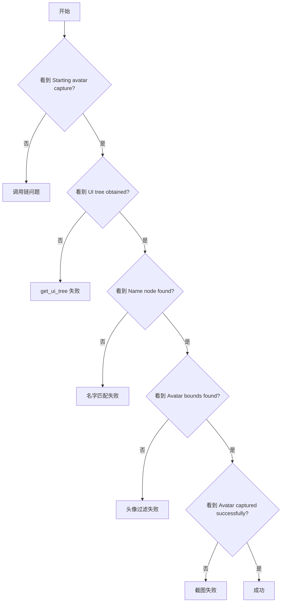

# Avatar Capture Debugging Guide

**创建日期**: 2026-01-18
**文档类型**: Debugging Guide

## 概述

本文档说明如何使用增强的日志系统来调试头像捕获失败的问题。所有头像相关日志现在都带有 `[AVATAR]` 前缀，便于过滤和查找。

---

## 日志级别和前缀

### 日志前缀

所有头像相关日志都使用 `[AVATAR]` 前缀：

```bash
# 过滤头像相关日志
grep "\[AVATAR\]" wecom.log

# 只查看头像错误
grep "\[AVATAR\].*ERROR" wecom.log
grep "\[AVATAR\].*WARNING" wecom.log

# 查看特定用户的头像日志
grep "\[AVATAR\].*张三" wecom.log
```

### 日志级别

| 级别      | 用途           | 示例场景                 |
| --------- | -------------- | ------------------------ |
| `INFO`    | 关键步骤和成功 | 捕获成功、使用默认头像   |
| `DEBUG`   | 详细执行过程   | 节点搜索、过滤判断       |
| `WARNING` | 非致命问题     | 名字未找到、使用默认头像 |
| `ERROR`   | 失败和异常     | UI 树获取失败、截图失败  |

---

## 完整日志流程

### 1. 启动捕获

```
[AVATAR] Starting avatar capture for user: 张三
[AVATAR] Max scroll attempts: 3
[AVATAR] Attempt 1: Trying to capture on current screen
```

**正常**：看到用户名和尝试次数

**异常**：如果没有看到这些日志，说明 `capture_if_needed` 没有被调用

---

### 2. 获取 UI 树

```
[AVATAR] _try_capture_once called for: 张三
[AVATAR] Checking if wecom_service has get_ui_tree method...
[AVATAR] Found get_ui_tree on wecom_service
[AVATAR] UI tree obtained successfully via wecom.get_ui_tree
```

#### 问题诊断

**问题 A**: `No get_ui_tree method found!`

```
[AVATAR] No get_ui_tree method found!
[AVATAR] Available attributes on wecom_service: [...]
```

**原因**：

- `WeComService` 实例没有 `get_ui_tree` 方法
- 传入的不是正确的 `WeComService` 实例

**解决方案**：

- 检查 `AvatarManager` 初始化时传入的 `wecom_service` 参数
- 确认 `WeComService` 有 `get_ui_tree` 方法或 `adb.get_ui_tree` 方法

**问题 B**: `get_ui_tree returned None`

```
[AVATAR] get_ui_tree returned None
```

**原因**：

- ADB 连接断开
- UI 树解析失败
- 设备屏幕关闭

**解决方案**：

```bash
# 检查 ADB 连接
adb devices

# 检查屏幕是否亮起
adb shell dumpsys window | grep "mShowingLockscreen"
```

---

### 3. 查找用户名节点

```
[AVATAR] _find_avatar_in_tree: searching for 张三
[AVATAR] Collected 1523 nodes from UI tree
[AVATAR] Looking for user name node: '张三'
[AVATAR] Found exact name match: '张三'
[AVATAR] Name bounds: [120,350][400,380]
[AVATAR] Name position: x=[120,400], y=[350,380]
```

#### 问题诊断

**问题 A**: `Name node not found`

```
[AVATAR] Name node not found for: '张三'
[AVATAR] Dumping visible texts (first 30): ['李四', '王五', '赵六', ...]
```

**原因**：

- UI 上没有显示这个用户的消息
- 用户名显示格式不同（如"张三 (备注)"）
- 名字有空格或特殊字符

**解决方案**：

- 滚动到包含该用户消息的位置
- 检查 `visible texts` 列表中是否有类似的名称
- 考虑使用模糊匹配（已在代码中实现）

**问题 B**: `Failed to parse name bounds`

```
[AVATAR] Name node found but no bounds: '张三'
[AVATAR] Failed to parse name bounds: [invalid_format]
```

**原因**：

- bounds 格式不是 `[x1,y1][x2,y2]`
- 节点的 bounds 字段为空或格式错误

**解决方案**：

- 检查 UI 树中 bounds 字段的格式
- 可能需要添加更多 bounds 解析逻辑

---

### 4. 查找头像节点

```
[AVATAR] Searching for avatar bounds for user: 张三
[AVATAR] Avatar bounds found: (50, 345, 100, 395)
[AVATAR] Avatar found matching all criteria:
[AVATAR]   bounds: [50,345][100,395]
[AVATAR]   size: 50x50, ratio: 1.00
[AVATAR]   class: android.widget.imageview, rid: com.tencent.wework:id/avatar
```

#### 问题诊断

**问题 A**: `Avatar bounds not found`

```
[AVATAR] Avatar bounds not found for user: 张三
```

**原因**：

- 没有符合条件的头像节点
- 头像与用户名不在同一行
- 头像尺寸不符合预期

**解决方案**：

- 查看下面的候选节点日志
- 调整过滤条件（见下文）

**问题 B**: `Found X avatar candidates but none matched all criteria`

```
[AVATAR] Found 5 avatar candidates but none matched all criteria:
[AVATAR] Candidate 1:
[AVATAR]   bounds: [60,340][110,390]
[AVATAR]   size: 50x50
[AVATAR]   class: android.widget.imageview
[AVATAR]   rid: com.tencent.wework:id/avatar
[AVATAR]   same_row: false
[AVATAR]   left_side: true
[AVATAR]   valid_size: true
[AVATAR]   square: true
[AVATAR]   rid_match: true
```

**分析过滤条件**：

| 条件         | 期望值 | 说明                                   |
| ------------ | ------ | -------------------------------------- |
| `same_row`   | `true` | 头像与名称 Y 坐标差距 < 100px          |
| `left_side`  | `true` | 头像 X 坐标 < 200px                    |
| `valid_size` | `true` | 宽和高都在 40-150px                    |
| `square`     | `true` | 宽高比在 0.7-1.3                       |
| `rid_match`  | 任意   | resource_id 包含 avatar/photo 等关键词 |

**常见失败原因**：

1. **`same_row: false`**
   - Y 坐标差距超过 100px
   - **解决方案**：增加 Y 轴容忍阈值（修改代码中 `abs(y1 - name_y) < 100`）

2. **`valid_size: false`**
   - 头像尺寸不在 40-150px 范围内
   - **解决方案**：调整尺寸范围（高分辨率设备可能需要更大范围）

3. **`left_side: false`**
   - 头像不在屏幕左侧（x1 >= 200）
   - **解决方案**：调整左侧阈值

---

### 5. 截图保存

```
[AVATAR] Target filepath: /path/to/avatars/avatar_张三.png
[AVATAR] Calling screenshot_element with bounds: [50,345][100,395]
[AVATAR] Avatar captured successfully: 张三 -> /path/to/avatars/avatar_张三.png
```

#### 问题诊断

**问题 A**: `screenshot_element method not found`

```
[AVATAR] screenshot_element method not found on wecom_service
```

**原因**：

- `WeComService` 没有 `screenshot_element` 方法

**解决方案**：

- 添加 `screenshot_element` 方法到 `WeComService` 或 `ADBService`

**问题 B**: `screenshot_element completed but file not found`

```
[AVATAR] screenshot_element completed but file not found: /path/to/avatars/avatar_张三.png
```

**原因**：

- 截图命令执行了但文件没有创建
- 权限问题
- 路径问题

**解决方案**：

```bash
# 检查目录权限
ls -la avatars/

# 手动测试截图
adb shell screencap -p /sdcard/screenshot.png
adb pull /sdcard/screenshot.png
```

---

### 6. 使用默认头像

```
[AVATAR] All capture attempts failed for 张三, using default avatar
[AVATAR] _use_default called for: 张三
[AVATAR] Default avatar not set or doesn't exist, trying to find avatar_default.png
[AVATAR] Default avatar found: /path/to/avatars/avatar_default.png
[AVATAR] Copying default avatar to: /path/to/avatars/avatar_张三.png
[AVATAR] Used default avatar for 张三: /path/to/avatars/avatar_张三.png
```

#### 问题诊断

**问题**: `No default avatar found`

```
[AVATAR] No default avatar found at /path/to/avatars/avatar_default.png
```

**原因**：

- `avatar_default.png` 不存在

**解决方案**：

```bash
# 创建默认头像
cp /path/to/some/default.png avatars/avatar_default.png
```

---

## 快速诊断流程图



---

## 常见问题和解决方案

### 问题 1: 所有用户头像都失败

**症状**：

```
[AVATAR] Name node not found for: 用户A
[AVATAR] Name node not found for: 用户B
[AVATAR] Dumping visible texts (first 30): []
```

**原因**：UI 树为空或没有文本节点

**解决方案**：

1. 确认设备屏幕已解锁
2. 确认 WeCom 在聊天窗口
3. 检查 ADB 连接

---

### 问题 2: 名字在 visible texts 但未匹配

**症状**：

```
[AVATAR] Dumping visible texts (first 30): ['张三 (技术部)', '李四', ...]
[AVATAR] Name node not found for: '张三'
```

**原因**：显示名称包含额外信息（部门、备注等）

**解决方案**：代码已实现包含匹配，应该会找到：

```
[AVATAR] Found partial name match: '张三 (技术部)' (looking for '张三')
```

如果还是失败，检查匹配逻辑是否正确执行。

---

### 问题 3: 头像候选节点存在但被过滤

**症状**：

```
[AVATAR] Found 3 avatar candidates but none matched all criteria:
[AVATAR] Candidate 1:
[AVATAR]   same_row: false  ← 这里有问题
[AVATAR]   valid_size: true
[AVATAR]   left_side: true
```

**原因**：过滤条件太严格

**解决方案**：根据实际情况调整过滤条件

- 如果 `same_row: false`，增加 Y 轴容忍阈值
- 如果 `valid_size: false`，扩大尺寸范围
- 如果 `left_side: false`，调整 X 轴阈值

---

## 调试技巧

### 1. 启用 DEBUG 日志

```python
import logging
logging.basicConfig(level=logging.DEBUG)
```

或通过环境变量：

```bash
export WECOM_DEBUG=true
uv run wecom-automation
```

### 2. 只查看特定用户的日志

```bash
grep "\[AVATAR\].*张三" wecom.log
```

### 3. 查看完整的头像捕获流程

```bash
grep "\[AVATAR\]" wecom.log | grep -E "(Starting|Obtained|Found|Searching|Captured)"
```

### 4. 导出日志到文件进行分析

```bash
grep "\[AVATAR\]" wecom.log > avatar_debug.log
```

---

## 修改后的代码位置

所有修改都在 `src/wecom_automation/services/user/avatar.py` 文件中：

| 方法                   | 行号    | 修改内容                 |
| ---------------------- | ------- | ------------------------ |
| `capture`              | 125-172 | 添加详细的尝试和失败日志 |
| `_try_capture_once`    | 174-244 | 添加 UI 树获取和截图日志 |
| `_use_default`         | 246-277 | 添加默认头像使用日志     |
| `_find_avatar_in_tree` | 279-401 | 添加节点搜索和过滤日志   |

---

## 示例：完整成功日志

```
[AVATAR] Starting avatar capture for user: 张三
[AVATAR] Max scroll attempts: 3
[AVATAR] Attempt 1: Trying to capture on current screen
[AVATAR] _try_capture_once called for: 张三
[AVATAR] Checking if wecom_service has get_ui_tree method...
[AVATAR] Found get_ui_tree on wecom_service
[AVATAR] UI tree obtained successfully via wecom.get_ui_tree
[AVATAR] Searching for avatar bounds for user: 张三
[AVATAR] _find_avatar_in_tree: searching for 张三
[AVATAR] Collected 1523 nodes from UI tree
[AVATAR] Looking for user name node: '张三'
[AVATAR] Found exact name match: '张三'
[AVATAR] Name bounds: [120,350][400,380]
[AVATAR] Name position: x=[120,400], y=[350,380]
[AVATAR] Avatar bounds found: (50, 345, 100, 395)
[AVATAR] Target filepath: /path/to/avatars/avatar_张三.png
[AVATAR] Calling screenshot_element with bounds: [50,345][100,395]
[AVATAR] Avatar captured successfully: 张三 -> /path/to/avatars/avatar_张三.png
[AVATAR] Successfully captured avatar for 张三 on first attempt
```

---

## 示例：完整失败日志

```
[AVATAR] Starting avatar capture for user: 张三
[AVATAR] Max scroll attempts: 3
[AVATAR] Attempt 1: Trying to capture on current screen
[AVATAR] _try_capture_once called for: 张三
[AVATAR] Checking if wecom_service has get_ui_tree method...
[AVATAR] Found get_ui_tree on wecom_service
[AVATAR] UI tree obtained successfully via wecom.get_ui_tree
[AVATAR] Searching for avatar bounds for user: 张三
[AVATAR] _find_avatar_in_tree: searching for 张三
[AVATAR] Collected 1523 nodes from UI tree
[AVATAR] Looking for user name node: '张三'
[AVATAR] Name node not found for: '张三'
[AVATAR] Dumping visible texts (first 30): ['李四', '王五', '赵六', ...]
[AVATAR] Avatar bounds not found for user: 张三
[AVATAR] First attempt failed, trying with scroll...
[AVATAR] Capture attempt 2/4
[AVATAR] Scrolling up...
[AVATAR] Trying to capture after scroll...
[AVATAR] _try_capture_once called for: 张三
[AVATAR] Checking if wecom_service has get_ui_tree method...
[AVATAR] Found get_ui_tree on wecom_service
[AVATAR] UI tree obtained successfully via wecom.get_ui_tree
[AVATAR] Searching for avatar bounds for user: 张三
[AVATAR] _find_avatar_in_tree: searching for 张三
[AVATAR] Collected 1523 nodes from UI tree
[AVATAR] Looking for user name node: '张三'
[AVATAR] Found exact name match: '张三'
[AVATAR] Name bounds: [120,350][400,380]
[AVATAR] Name position: x=[120,400], y=[350,380]
[AVATAR] Avatar bounds not found for user: 张三
[AVATAR] Capture attempt 3/4
[AVATAR] Scrolling up...
[AVATAR] Trying to capture after scroll...
...
[AVATAR] All capture attempts failed for 张三, using default avatar
[AVATAR] _use_default called for: 张三
[AVATAR] Default avatar not set or doesn't exist, trying to find avatar_default.png
[AVATAR] No default avatar found at /path/to/avatars/avatar_default.png
```

**分析**：

1. 第一次尝试：名字没找到（可能不在当前屏幕）
2. 第二次尝试（滚动后）：名字找到了，但头像没找到
3. 所有尝试失败后：默认头像也不存在

**可能原因**：

- UI 布局不同，头像不在预期位置
- 需要查看候选节点日志来确定具体过滤条件

---

## 相关文档

- 问题分析文档: `docs/04-bugs-and-fixes/active/01-18-avatar-capture-failure-analysis.md`
- 本调试指南: `docs/04-bugs-and-fixes/active/01-18-avatar-debug-guide.md`

---

## 总结

通过增强的日志系统，你可以：

1. **快速定位问题**：通过 `[AVATAR]` 前缀过滤日志
2. **了解执行流程**：每个关键步骤都有日志
3. **诊断失败原因**：详细的错误信息和上下文
4. **验证修复效果**：对比修复前后的日志输出

调试时建议：

- 启用 DEBUG 级别日志
- 关注 WARNING 和 ERROR 级别的日志
- 查看 "visible texts" 了解实际显示的内容
- 检查 "avatar candidates" 了解过滤失败的具体原因
