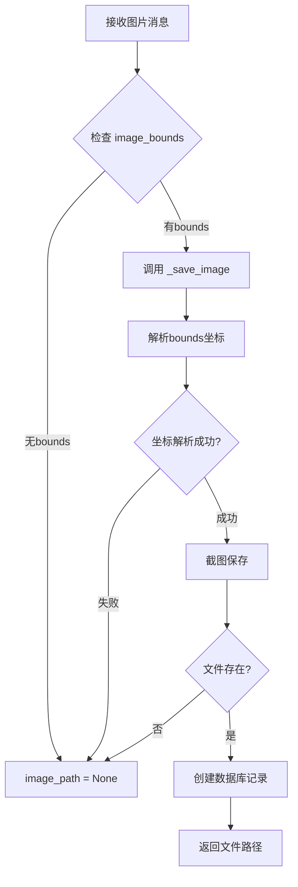
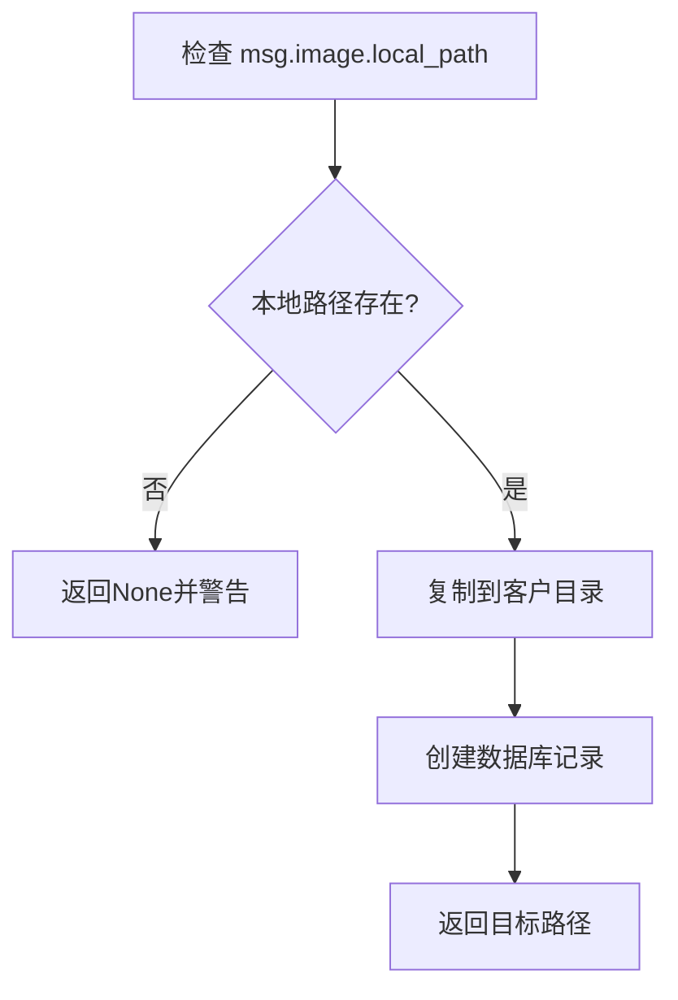

# 图片保存路径显示为None问题分析

## 问题描述

在保存图片时，日志显示图片路径为 `None`，但日志信息却显示 "Image message **saved**"：

```
22:07:52 [INFO] sync: Image message saved: customer=B2601020037 (保底正常), path=None
```


> [!CAUTION]
> **日志信息具有误导性**：日志显示 "Image message saved"（图片消息已保存），但 `path=None` 表明图片实际上**没有被成功保存**到磁盘。这会让开发者误以为图片保存成功了。

## 核心问题

| 日志显示              | 实际情况                   |
| --------------------- | -------------------------- |
| "Image message saved" | 仅消息记录被保存到数据库   |
| `path=None`           | **图片文件未被保存到磁盘** |

## 日志来源

该日志来自 `src/wecom_automation/services/message/handlers/image.py` 第127-130行：

```python
self._logger.info(
    f"Image message saved: customer={context.customer_name}, "
    f"path={image_path}"
)
```

> [!WARNING]
> 无论图片是否保存成功，这条日志都会输出 "saved"，这是代码逻辑的缺陷。

---

## 问题分析

### 图片保存流程

系统中存在两套图片保存逻辑：

1. **ImageMessageHandler (image.py)** - 新的消息处理器架构
2. **sync_service.\_save_message_image()** - 原有的同步服务

#### 1. ImageMessageHandler 流程



#### 2. sync_service 流程



---

## 导致 path=None 的原因

### 原因 1: 缺少 image_bounds（属性路径不匹配）

**位置**: `image.py` 第 93 行

```python
image_bounds = getattr(message, 'image_bounds', None)
```

**根本原因**:

`ImageMessageHandler` 期望消息对象上有一个 `image_bounds` 属性，但 **`ConversationMessage` 模型根本没有这个属性**！

**数据模型结构** (`models.py` 第 489-519 行):

```python
@dataclass
class ConversationMessage:
    content: Optional[str] = None
    timestamp: Optional[str] = None
    is_self: bool = False
    message_type: str = "text"
    image: Optional[ImageInfo] = None  # ← 图片信息在这里
    # ... 没有 image_bounds 属性
```

**正确的访问路径**:

| 错误用法 (当前代码)    | 正确用法               |
| ---------------------- | ---------------------- |
| `message.image_bounds` | `message.image.bounds` |

**代码对比**:

```python
# ❌ 当前代码 (image.py 第 93 行) - 永远返回 None
image_bounds = getattr(message, 'image_bounds', None)

# ✅ 正确写法
image_bounds = message.image.bounds if message.image else None
```

**sync_service.py 的正确用法** (第 2513-2515 行):

```python
if msg_type == MessageType.IMAGE and msg.image:
    if msg.image.bounds:  # ← 正确！通过 msg.image.bounds 访问
        extra_info["image_bounds"] = msg.image.bounds
```

**影响**:

- `ImageMessageHandler.process()` 总是获取 `image_bounds = None`
- 日志显示 `"No image_bounds for message, cannot save image"`
- 图片无法保存，只会在数据库中创建消息记录，内容显示为"[图片]"

---

### 原因 2: bounds 格式解析失败

**位置**: `image.py` 第196-215行

```python
def _parse_bounds(self, bounds: str) -> Optional[tuple]:
    match = re.match(r'\[(\d+),(\d+)\]\[(\d+),(\d+)\]', bounds)
    if match:
        return tuple(map(int, match.groups()))
    return None
```

**触发条件**: bounds 字符串格式不符合预期（如 `[100,200][300,400]`）

**影响**: 无法解析坐标，截图步骤被跳过

---

### 原因 3: 截图失败

**位置**: `image.py` 第171行

```python
await self._wecom.screenshot_element(bounds, str(filepath))
```

**触发条件**:

- 设备连接问题
- ADB命令执行失败
- 权限问题

**影响**: 文件路径不存在，方法返回 `None`

---

### 原因 4: 图片未被内联捕获 (sync_service)

**位置**: `sync_service.py` 第2725-2733行

```python
else:
    # Image was NOT captured inline
    self.logger.warning(
        f"Image for message {message_id} was not captured inline. "
        "This usually means the image was partially cut off during scroll."
    )
    return None
```

**触发条件**:

- 图片在屏幕滚动时被部分切割
- `download_images=False` 设置
- 消息提取时图片不在可见区域内

**影响**: 消息记录中只有"[图片]"标记，没有实际图片文件

---

## 图片被保存到哪里？

当保存成功时，图片会被保存到：

| 场景                | 保存位置                                                               |
| ------------------- | ---------------------------------------------------------------------- |
| ImageMessageHandler | `{images_dir}/customer_{customer_id}/msg_{message_id}_{timestamp}.png` |
| sync_service        | `{images_dir}/customer_{customer_id}/msg_{message_id}_{timestamp}.png` |

**典型路径示例**:

```
output/images/customer_123/msg_456_20260118_120530.png
```

---

## 问题影响

### 1. 数据不完整

- 消息记录存在，但缺少实际图片文件
- 用户界面只能显示"[图片]"占位符

### 2. 存储资源浪费

- 如果部分捕获失败，可能需要重新同步来补全图片

### 3. 用户体验降低

- 历史对话中的图片无法查看
- 无法进行图片内容分析

### 4. 调试困难

- 日志显示 "saved" 但实际未保存，造成混淆
- 日志只显示 `path=None`，没有详细的失败原因

---

## 解决方案

### 优先修复：修正误导性日志

**问题代码** (`image.py` 第127-137行):

```python
# 当前代码 - 无论是否保存成功都显示 "saved"
self._logger.info(
    f"Image message saved: customer={context.customer_name}, "
    f"path={image_path}"
)

return MessageProcessResult(
    added=True,
    message_type="image",
    message_id=msg_record.id if msg_record else None,
    extra={"path": str(image_path) if image_path else None},
)
```

**建议修复**:

```python
# 修复后 - 根据保存结果显示不同日志
if image_path:
    self._logger.info(
        f"Image saved successfully: customer={context.customer_name}, "
        f"path={image_path}"
    )
else:
    self._logger.warning(
        f"Image NOT saved (missing bounds or capture failed): "
        f"customer={context.customer_name}"
    )

return MessageProcessResult(
    added=True,
    message_type="image",
    message_id=msg_record.id if msg_record else None,
    extra={"path": str(image_path) if image_path else None},
)
```

---

### 短期修复

#### 1. 增强日志记录

在 `image.py` 中添加更详细的失败原因日志：

```python
# 在 process 方法中
if not image_bounds:
    self._logger.warning(
        f"No image_bounds for message, cannot save image. "
        f"customer={context.customer_name}"
    )
elif not msg_record:
    self._logger.warning(f"No message record created, cannot save image")
```

#### 2. 验证 bounds 有效性

在保存前检查 bounds 格式：

```python
async def _save_image(self, message, customer_id, message_id, bounds):
    parsed = self._parse_bounds(bounds)
    if not parsed:
        self._logger.error(f"Invalid bounds format: {bounds}")
        return None
    # ... 继续保存逻辑
```

---

### 长期优化

#### 1. 统一图片处理逻辑

当前存在两套图片处理逻辑（`ImageMessageHandler` 和 `sync_service._save_message_image`），建议：

- 统一使用 `ImageMessageHandler` 处理所有图片
- 确保 `msg.image.local_path` 在提取时就被正确设置

#### 2. 重试机制

对于截图失败的情况，添加重试逻辑：

```python
max_retries = 3
for attempt in range(max_retries):
    try:
        await self._wecom.screenshot_element(bounds, str(filepath))
        if filepath.exists():
            break
    except Exception as e:
        self._logger.warning(f"Screenshot attempt {attempt+1} failed: {e}")
        await asyncio.sleep(0.5)
```

#### 3. 边缘检测

在提取消息时检测图片是否在可视区域内：

```python
def is_image_fully_visible(bounds, screen_height):
    """检查图片是否完全在可视区域内"""
    parsed = parse_bounds(bounds)
    if not parsed:
        return False
    x1, y1, x2, y2 = parsed
    # 留出边距确保图片完整
    margin = 20
    return y1 >= margin and y2 <= (screen_height - margin)
```

---

## 验证步骤

1. **检查日志**: 观察是否有更详细的失败原因
2. **检查 bounds**: 验证消息对象是否正确包含 `image_bounds` 属性
3. **检查目录权限**: 确保 `images_dir` 目录可写
4. **检查设备连接**: 确保 ADB 连接稳定

---

## 相关文件

- [image.py](file:///d:/111/android_run_test-main/src/wecom_automation/services/message/handlers/image.py) - 图片消息处理器
- [sync_service.py](file:///d:/111/android_run_test-main/src/wecom_automation/services/sync_service.py) - 同步服务中的图片保存逻辑 (第2643-2733行)
- [models.py](file:///d:/111/android_run_test-main/src/wecom_automation/core/models.py) - 消息模型定义

---

## 创建日期

2026-01-18
