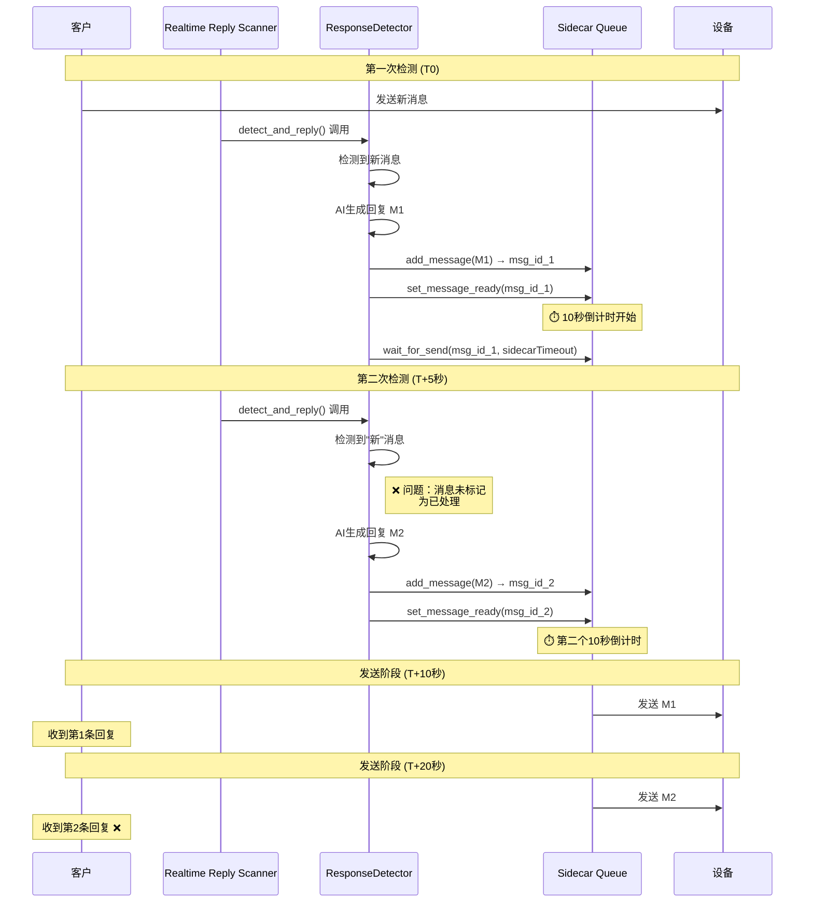

# 实时回复重复发送问题分析

> **日期**: 2026-02-06
> **问题**: 实时回复在10秒倒计时期间检测到新消息，导致重复发送回复
> **严重程度**: P1 (High - 影响用户体验)
> **状态**: 🔴 待修复

> **Documentation note (2026-04-15):** Sidecar review wait defaults to **60 s** (`sidecar_timeout`). Diagrams and snippets below still say **300 s** where they described the older default; behaviour is the same except for duration. See [Sidecar review timeout defaults](../../sidecar/sidecar-review-timeout-defaults.md).

---

## 🔴 问题描述

### 症状

用户报告：在某些情况下，客户会收到**两条相同的回复消息**。

### 复现步骤

1. T0: 客户发送一条新消息给客服
2. T1 (0秒后): Realtime Reply 检测到新消息，AI生成回复M1，发送到Sidecar队列
3. T2: Sidecar开始10秒倒计时
4. T3 (5秒后): Realtime Reply 的下一次扫描开始（比如每60秒扫描一次）
5. T4: 系统再次检测到同一条新消息（因为还未标记为已回复）
6. T5: AI又生成了回复M2，发送到Sidecar队列
7. T6 (10秒到): M1被发送
8. T7 (再10秒后): M2被发送
9. **结果**: 客户收到了两条回复消息

### 影响范围

- **用户体验**: 客户感到困惑和被打扰
- **客服形象**: 显得不专业、像机器人故障
- **资源浪费**: 浪费AI API额度和系统资源
- **数据准确性**: 消息记录不准确

---

## 🔍 根本原因分析

### 当前实现流程



### 竞态条件分析

#### 时间窗口问题

| 时间点 | 事件                          | 状态             |
| ------ | ----------------------------- | ---------------- |
| T0     | 客户发送新消息                | 消息未读         |
| T1     | 第一次扫描开始                | 检测到新消息     |
| T2     | AI生成回复M1，加入Sidecar队列 | 10秒倒计时开始   |
| T3-T5  | 等待倒计时...                 | **危险窗口** ⚠️  |
| T5     | 第二次扫描开始                | **重复检测** ❌  |
| T6     | AI生成回复M2，加入队列        | 第二条消息入队   |
| T10    | M1发送成功                    | 客户收到第1条    |
| T20    | M2发送成功                    | 客户收到第2条 ❌ |

#### 代码层面分析

**问题1: 消息状态未及时标记**

```python
# response_detector.py:2379-2386
# Step 2: 标记消息为就绪（启动10秒倒计时）
if not await sidecar_client.set_message_ready(msg_id):
    self._logger.warning(f"[{serial}] Failed to mark message as ready")
else:
    self._logger.info(f"[{serial}] ⏱️ Countdown started, waiting for send...")

    # Step 3: 等待用户审核/发送（时长 sidecar_timeout，默认 60 秒）
    result = await sidecar_client.wait_for_send(msg_id, timeout=sidecar_timeout)
```

**问题**: 在 `wait_for_send()` 期间，消息的状态没有标记为"处理中"。

**问题2: 扫描间隔与倒计时重叠**

```python
# realtime_reply_process.py:198-230
while True:
    scan_count += 1
    logger.info(f"[Scan #{scan_count}] Checking for unread messages...")

    # 调用检测器
    result = await detector.detect_and_reply(
        device_serial=args.serial,
        interactive_wait_timeout=10,
        sidecar_client=sidecar_client,
    )

    # 等待下一个扫描周期
    logger.info(f"Sleeping {args.scan_interval}s until next scan...")
    await asyncio.sleep(args.scan_interval)  # 默认60秒
```

**问题**: 如果 `scan_interval=60`，但 `detect_and_reply` 内部会阻塞等待 Sidecar 审核（时长为 `sidecar_timeout`，默认 60 秒），会导致：

- 下一次扫描可能在当前扫描的 `wait_for_send()` 期间开始
- 没有全局锁保护同一设备的并发扫描

**问题3: 缺少"正在处理"标记**

```python
# response_detector.py 中的消息检测逻辑
async def detect_and_reply(...):
    # ...
    for user_info in users_with_unread:
        # 进入聊天，提取消息
        messages = await self._extract_messages(...)

        # ❌ 问题：这里没有检查该消息是否已经在处理中
        for msg in messages:
            # 直接生成回复，没有状态检查
            reply = await self._generate_reply(...)

            # 发送到Sidecar
            await sidecar_client.add_message(...)
```

---

## 💡 解决方案

### 方案概述

采用**三层防护**机制，从多个层面防止重复回复：

1. **全局扫描锁**: 防止同一设备的并发扫描
2. **消息处理状态表**: 跟踪正在处理的消息
3. **Sidecar队列去重**: 在Sidecar层面防止重复消息

---

## 📋 详细设计方案

### 方案1: 全局扫描锁（推荐首先实施）✅

**原理**: 确保同一设备在同一时间只有一个扫描任务在运行。

#### 实施步骤

**Step 1: 在 ResponseDetector 中添加锁**

```python
# response_detector.py

class ResponseDetector:
    def __init__(self, ...):
        # ...
        # 添加全局锁字典，按设备序列号分组
        self._device_scan_locks: Dict[str, asyncio.Lock] = {}
        self._locks_lock = asyncio.Lock()  # 用于保护 _device_scan_locks 的访问

    async def _get_device_lock(self, device_serial: str) -> asyncio.Lock:
        """获取设备的扫描锁（线程安全）"""
        async with self._locks_lock:
            if device_serial not in self._device_scan_locks:
                self._device_scan_locks[device_serial] = asyncio.Lock()
            return self._device_scan_locks[device_serial]

    async def detect_and_reply(
        self,
        device_serial: str | None = None,
        interactive_wait_timeout: int = 40,
        sidecar_client: Any | None = None,
    ) -> dict[str, Any]:
        """检测客户回复并自动回复（带并发保护）"""

        # 🔒 获取设备锁
        device_lock = await self._get_device_lock(device_serial)

        # 检查是否已经有扫描在进行
        if device_lock.locked():
            self._logger.info(
                f"[{device_serial}] ⏸️ Scan already in progress, skipping this cycle"
            )
            return {
                "scan_time": datetime.now().isoformat(),
                "responses_detected": 0,
                "skipped": True,
                "reason": "Scan already in progress",
            }

        # 🔒 获取锁后才开始扫描
        async with device_lock:
            self._logger.info(f"[{device_serial}] 🔒 Acquired scan lock")

            # ... 原有的检测逻辑 ...

            self._logger.info(f"[{device_serial}] 🔓 Released scan lock")
```

**优点**:

- ✅ 实现简单，改动最小
- ✅ 立即生效，防止所有并发扫描
- ✅ 不需要数据库改动

**缺点**:

- ❌ 可能延长扫描周期（如果前一个扫描耗时很长）
- ❌ 无法区分是否是同一条消息

---

### 方案2: 消息处理状态表（推荐完整实施）✅

**原理**: 在数据库中记录正在处理的消息，防止重复生成回复。

#### 数据库Schema

```sql
-- 在 settings 数据库中创建新表
CREATE TABLE IF NOT EXISTS message_processing_status (
    id INTEGER PRIMARY KEY AUTOINCREMENT,
    device_serial TEXT NOT NULL,
    customer_name TEXT NOT NULL,
    customer_channel TEXT,
    message_id TEXT NOT NULL,  -- 消息的唯一标识
    message_content TEXT,  -- 消息内容（用于去重）
    status TEXT NOT NULL,  -- 'processing', 'sent', 'cancelled', 'failed'
    sidecar_msg_id TEXT,  -- Sidecar 队列消息ID
    created_at DATETIME DEFAULT CURRENT_TIMESTAMP,
    updated_at DATETIME DEFAULT CURRENT_TIMESTAMP,
    completed_at DATETIME,

    -- 索引
    UNIQUE(device_serial, customer_name, message_id),
    INDEX idx_device_status (device_serial, status),
    INDEX idx_created_at (created_at)
);

-- 自动清理已完成记录的触发器（保留7天）
CREATE TRIGGER IF NOT EXISTS cleanup_old_status
AFTER INSERT ON message_processing_status
BEGIN
    DELETE FROM message_processing_status
    WHERE status IN ('sent', 'cancelled', 'failed')
      AND datetime(completed_at) < datetime('now', '-7 days');
END;
```

#### 代码实现

```python
# services/realtime/message_status_repository.py

from __future__ import annotations
import aiosqlite
from dataclasses import dataclass
from datetime import datetime
from enum import Enum
from typing import Optional

class MessageProcessingStatus(str, Enum):
    """消息处理状态"""
    PROCESSING = "processing"  # 正在处理（AI生成、倒计时中）
    SENT = "sent"              # 已发送
    CANCELLED = "cancelled"    # 已取消
    FAILED = "failed"          # 发送失败

@dataclass
class MessageProcessingRecord:
    """消息处理记录"""
    id: int
    device_serial: str
    customer_name: str
    customer_channel: Optional[str]
    message_id: str
    message_content: Optional[str]
    status: MessageProcessingStatus
    sidecar_msg_id: Optional[str]
    created_at: str
    updated_at: str
    completed_at: Optional[str]

class MessageStatusRepository:
    """消息处理状态仓库"""

    def __init__(self, db_path: str):
        self.db_path = db_path
        self._init_table()

    def _init_table(self):
        """初始化表"""
        with aiosqlite.connect(self.db_path) as db:
            db.execute("""
                CREATE TABLE IF NOT EXISTS message_processing_status (
                    id INTEGER PRIMARY KEY AUTOINCREMENT,
                    device_serial TEXT NOT NULL,
                    customer_name TEXT NOT NULL,
                    customer_channel TEXT,
                    message_id TEXT NOT NULL,
                    message_content TEXT,
                    status TEXT NOT NULL,
                    sidecar_msg_id TEXT,
                    created_at DATETIME DEFAULT CURRENT_TIMESTAMP,
                    updated_at DATETIME DEFAULT CURRENT_TIMESTAMP,
                    completed_at DATETIME,
                    UNIQUE(device_serial, customer_name, message_id)
                )
            """)
            db.commit()

    async def is_message_processing(
        self,
        device_serial: str,
        customer_name: str,
        message_id: str
    ) -> bool:
        """检查消息是否正在处理"""
        async with aiosqlite.connect(self.db_path) as db:
            cursor = await db.execute(
                """
                SELECT COUNT(*) FROM message_processing_status
                WHERE device_serial = ?
                  AND customer_name = ?
                  AND message_id = ?
                  AND status = 'processing'
                """,
                (device_serial, customer_name, message_id)
            )
            count = await cursor.fetchone()
            return count[0] > 0

    async def mark_as_processing(
        self,
        device_serial: str,
        customer_name: str,
        customer_channel: Optional[str],
        message_id: str,
        message_content: Optional[str],
        sidecar_msg_id: Optional[str] = None
    ) -> bool:
        """标记消息为正在处理"""
        try:
            async with aiosqlite.connect(self.db_path) as db:
                await db.execute(
                    """
                    INSERT OR REPLACE INTO message_processing_status
                    (device_serial, customer_name, customer_channel, message_id,
                     message_content, status, sidecar_msg_id, created_at, updated_at)
                    VALUES (?, ?, ?, ?, ?, 'processing', ?, CURRENT_TIMESTAMP, CURRENT_TIMESTAMP)
                    """,
                    (device_serial, customer_name, customer_channel, message_id,
                     message_content, sidecar_msg_id)
                )
                await db.commit()
                return True
        except Exception as e:
            print(f"Error marking message as processing: {e}")
            return False

    async def mark_as_sent(
        self,
        device_serial: str,
        customer_name: str,
        message_id: str,
        sidecar_msg_id: Optional[str] = None
    ) -> bool:
        """标记消息为已发送"""
        try:
            async with aiosqlite.connect(self.db_path) as db:
                await db.execute(
                    """
                    UPDATE message_processing_status
                    SET status = 'sent',
                        completed_at = CURRENT_TIMESTAMP,
                        updated_at = CURRENT_TIMESTAMP
                    WHERE device_serial = ?
                      AND customer_name = ?
                      AND message_id = ?
                      AND status = 'processing'
                    """,
                    (device_serial, customer_name, message_id)
                )
                await db.commit()
                return True
        except Exception as e:
            print(f"Error marking message as sent: {e}")
            return False

    async def cancel_processing(
        self,
        device_serial: str,
        customer_name: str,
        message_id: str
    ) -> bool:
        """取消消息处理"""
        try:
            async with aiosqlite.connect(self.db_path) as db:
                await db.execute(
                    """
                    UPDATE message_processing_status
                    SET status = 'cancelled',
                        completed_at = CURRENT_TIMESTAMP,
                        updated_at = CURRENT_TIMESTAMP
                    WHERE device_serial = ?
                      AND customer_name = ?
                      AND message_id = ?
                      AND status = 'processing'
                    """,
                    (device_serial, customer_name, message_id)
                )
                await db.commit()
                return True
        except Exception as e:
            print(f"Error cancelling message processing: {e}")
            return False

    async def cleanup_stale_records(self, max_age_minutes: int = 30) -> int:
        """清理过期的处理中记录（防止死锁）"""
        async with aiosqlite.connect(self.db_path) as db:
            cursor = await db.execute(
                """
                UPDATE message_processing_status
                SET status = 'failed',
                    completed_at = CURRENT_TIMESTAMP,
                    updated_at = CURRENT_TIMESTAMP
                WHERE status = 'processing'
                  AND datetime(created_at) < datetime('now', '-' || ? || ' minutes')
                """,
                (max_age_minutes,)
            )
            await db.commit()
            return cursor.rowcount
```

#### 集成到 ResponseDetector

```python
# response_detector.py

class ResponseDetector:
    def __init__(self, ...):
        # ...
        from services.realtime.message_status_repository import MessageStatusRepository
        self._message_status_repo = MessageStatusRepository(db_path)

    async def detect_and_reply(self, ...):
        """检测客户回复并自动回复（带重复防护）"""

        # ... 现有的逻辑 ...

        for user_info in users_with_unread:
            user_name = user_info["name"]
            user_channel = user_info.get("channel")

            # 进入聊天，提取消息
            messages = await self._extract_messages(
                device_serial, user_name, user_channel
            )

            for msg in messages:
                # 🔒 生成消息唯一ID
                message_id = self._generate_message_id(msg)

                # ✅ 检查消息是否正在处理
                if await self._message_status_repo.is_message_processing(
                    device_serial, user_name, message_id
                ):
                    self._logger.info(
                        f"[{device_serial}] ⏭️ Message {message_id} already processing, skipping"
                    )
                    continue

                # 生成回复
                reply = await self._generate_reply(...)

                # 发送到Sidecar
                msg_id = await sidecar_client.add_message(
                    contact_name=user_name,
                    channel=user_channel,
                    message=reply
                )

                # ✅ 标记为正在处理
                await self._message_status_repo.mark_as_processing(
                    device_serial=device_serial,
                    customer_name=user_name,
                    customer_channel=user_channel,
                    message_id=message_id,
                    message_content=msg.get("text"),
                    sidecar_msg_id=msg_id
                )

                # 启动倒计时
                await sidecar_client.set_message_ready(msg_id)

                # 等待发送
                result = await sidecar_client.wait_for_send(msg_id, timeout=sidecar_timeout)

                if result.get("success") or result.get("reason") == "sent":
                    # ✅ 标记为已发送
                    await self._message_status_repo.mark_as_sent(
                        device_serial, user_name, message_id
                    )
                else:
                    # 取消或失败
                    await self._message_status_repo.cancel_processing(
                        device_serial, user_name, message_id
                    )

    def _generate_message_id(self, message: dict) -> str:
        """生成消息唯一ID"""
        import hashlib
        content = message.get("text", "")
        timestamp = message.get("timestamp", "")
        sender = message.get("sender", "")

        # 使用内容+时间戳+发送者生成唯一ID
        unique_str = f"{sender}:{timestamp}:{content}"
        return hashlib.md5(unique_str.encode()).hexdigest()[:16]
```

**优点**:

- ✅ 精确防止同一条消息重复处理
- ✅ 可追溯处理历史
- ✅ 支持自动清理过期记录

**缺点**:

- ❌ 需要数据库改动
- ❌ 实现复杂度较高

---

### 方案3: Sidecar队列去重（补充方案）✅

**原理**: 在Sidecar队列层面检查是否有相同目标用户的待发送消息。

#### 实施步骤

```python
# services/integration/sidecar.py

class SidecarQueueClient:
    async def add_message(
        self,
        contact_name: str,
        channel: str | None,
        message: str
    ) -> str | None:
        """添加消息到队列（带去重检查）"""

        # ✅ 检查是否已有相同联系人的READY状态消息
        existing = await self._get_pending_message(contact_name, channel)

        if existing:
            self._logger.warning(
                f"⚠️ Pending message exists for {contact_name}, "
                f"replacing old message (ID: {existing['id']})"
            )

            # 取消旧消息
            await self.update_status(existing['id'], QueueStatus.CANCELLED)

        # 添加新消息
        # ... 原有逻辑 ...
```

**优点**:

- ✅ 在Sidecar层面统一处理
- ✅ 自动替换旧消息，避免重复

**缺点**:

- ❌ 可能误删用户想要保留的消息
- ❌ 无法区分是否是同一条消息触发的回复

---

## 🎯 推荐实施方案

### 阶段1: 紧急修复（1-2小时）

**实施**: 方案1 - 全局扫描锁

**优先级**: 🔴 P0 - 立即实施

**原因**:

- 改动最小，风险最低
- 立即见效，防止并发扫描
- 不依赖数据库改动

**步骤**:

1. 在 `ResponseDetector` 中添加 `asyncio.Lock`
2. 在 `detect_and_reply()` 开始时获取锁
3. 测试验证

---

### 阶段2: 完整修复（4-6小时）

**实施**: 方案2 - 消息处理状态表

**优先级**: 🟡 P1 - 本周完成

**原因**:

- 从根源解决问题
- 提供完整的状态跟踪
- 支持监控和调试

**步骤**:

1. 创建 `message_processing_status` 表
2. 实现 `MessageStatusRepository`
3. 集成到 `ResponseDetector` 和 `FollowUpExecutor`
4. 添加监控API
5. 测试验证

---

### 阶段3: 增强防护（可选，2-3小时）

**实施**: 方案3 - Sidecar队列去重

**优先级**: 🟢 P2 - 有余力时实施

**原因**:

- 提供最后一层防护
- 在Sidecar层面统一处理
- 提升用户体验（自动替换旧消息）

---

## 📊 监控和验证

### 验证测试场景

#### 测试1: 正常回复（无重复）

```
1. 客户发送消息 "你好"
2. 等待回复
3. 预期：收到1条回复
```

#### 测试2: 快速连续消息（不重复）

```
1. 客户发送消息 "你好"
2. 5秒后客户发送消息 "在吗"
3. 预期：收到2条不同的回复
```

#### 测试3: 扫描周期重叠（不重复）

```
1. 设置扫描间隔为10秒
2. 客户发送消息
3. 预期：收到1条回复
```

### 监控指标

| 指标         | 说明                       | 目标值 |
| ------------ | -------------------------- | ------ |
| 重复回复率   | 同一客户收到相同回复的比例 | < 0.1% |
| 扫描跳过次数 | 因锁冲突跳过的扫描次数     | < 5%   |
| 平均处理时间 | 从检测到发送的平均时间     | < 15秒 |

### 日志关键字

```
✅ 成功日志:
"🔒 Acquired scan lock"
"⏭️ Message already processing, skipping"
"✅ Message marked as processing"
"✅ Message marked as sent"

❌ 异常日志:
"⚠️ Scan already in progress"
"❌ Duplicate message detected"
"⚠️ Pending message exists, replacing"
```

---

## 🛠️ 实施清单

### 阶段1: 全局扫描锁

- [ ] 在 `ResponseDetector` 添加 `_device_scan_locks` 字典
- [ ] 实现 `_get_device_lock()` 方法
- [ ] 在 `detect_and_reply()` 添加锁保护
- [ ] 添加日志输出
- [ ] 编写单元测试
- [ ] 手动测试验证

### 阶段2: 消息处理状态表

- [ ] 创建数据库迁移脚本
- [ ] 实现 `MessageStatusRepository`
- [ ] 实现 `is_message_processing()`
- [ ] 实现 `mark_as_processing()`
- [ ] 实现 `mark_as_sent()`
- [ ] 实现 `cancel_processing()`
- [ ] 实现 `cleanup_stale_records()`
- [ ] 集成到 `ResponseDetector`
- [ ] 添加监控API
- [ ] 编写集成测试
- [ ] 手动测试验证

### 阶段3: Sidecar队列去重

- [ ] 在 `SidecarQueueClient` 添加去重检查
- [ ] 实现 `_get_pending_message()`
- [ ] 添加自动替换逻辑
- [ ] 添加日志输出
- [ ] 编写单元测试
- [ ] 手动测试验证

---

## 📚 相关文档

- [Realtime Reply 设计](../../01-product/realtime-reply-system.md)
- [Sidecar 队列系统](../../01-product/sidecar-queue-system.md)
- [并发控制最佳实践](../../03-impl-and-arch/best-practices/concurrency-control.md)

---

## 🔄 后续优化

### 智能扫描间隔

根据当前是否有待发送消息，动态调整扫描间隔：

```python
# 如果有待发送消息，延长扫描间隔
if sidecar_client.has_pending_messages():
    scan_interval = 120  # 2分钟
else:
    scan_interval = 60  # 1分钟
```

### 消息合并策略

如果检测到同一客户的多次新消息，合并为一条回复：

```python
# 收集同一客户的5分钟内所有消息
# 生成一条综合回复
```

### 用户反馈学习

记录用户取消的回复，调整AI生成策略：

```python
# 如果用户经常取消某类回复
# 降低此类回复的生成频率
```

---

**文档版本**: 1.0
**创建日期**: 2026-02-06
**作者**: Claude Code
**状态**: 🔴 待实施
