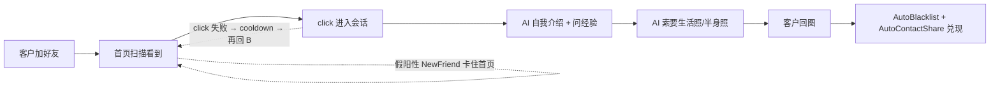

# 新好友假阳性 + 点击循环死锁导致照片率塌方

## Status

**Resolved (2026-05-12)** — 根因分析基于 2026-05-05 / 05-06 / 05-09 / 05-10 四天日志；代码与监控修复已合入。设备样例：`10AE9X304J0033Z`。

**实施说明（代码级）**：[implementation/2026-05-12-new-friend-click-loop-photo-rate-remediation.md](../../implementation/2026-05-12-new-friend-click-loop-photo-rate-remediation.md)

## Symptoms

业务侧度量：

> **照片率 = 当天新加好友里发过照片/视频的人 / 当天新加好友总数**

四天数值持续偏低，05-10 跌到全周低点。看起来像是「客户不发照片」或「AI 文案不够吸引」，但实际是机器人**根本没机会**把会话推到「请发生活照」那一步。

## Evidence — 4 日宏观数据

| 指标 | 05-05 | 05-06 | 05-09 | 05-10 |
|---|---:|---:|---:|---:|
| 日志行数 | 349K | 257K | 657K | 309K |
| WARNING 总数 | 4,426 | 1,636 | **41,161** | 14,406 |
| ERROR 总数 | 44 | 107 | 23 | **2,409** |
| 扫描次数 (`[Scan #N]`) | 1,080 | 1,449 | 1,051 | 1,970 |
| **首页 `NewFriend=True` 触发次数** | 167 | 178 | **9,965** | 1,952 |
| 首页见过的真新好友（独立人数） | 49 | 33 | 47 | **17** |
| **实际成功点开的独立客户** | 99 | 93 | 75 | **48** |
| **当天发出的 AI 回复（条）** | 947 | 713 | 511 | **195** |
| 触发 AutoContactShare（=客户发了图片） | 0 | 0 | 192 | 72 |
| `auto_blacklist` 成功 | 0 | 0 | 33 | 12 |
| Click cooldown 跳过次数 | 575 | 0 | **9,858** | 3,377 |
| Click 5 次滚动后找不到 | 12 | 7 | 183 | 108 |
| `device 'XXX' not found` | 38 | 18 | 19 | 0 |

吞吐量崩塌曲线：**947 → 713 → 511 → 195**（05-10 比 05-05 跌 79%）。这是「照片率」分子掉的真正原因——分母（新加客户）由前端业务流量决定，没有大变化，但漏斗第一步就把客户挡在外面了。

### Top 卡死用户（罪魁祸首）

**05-09**：

| 客户 | 进 priority 队列次数 | Click cooldown 跳过次数 |
|---|---:|---:|
| `B2605080143-(保底正常)` | 9,891 | 9,774 |
| `B2510170249-[重复(保底正常)]` | — | 30 |
| `31768235-[重复(保底正常)]` | — | 30 |
| `B2605090345-(保底正常)` | — | 24 |

**05-10**：

| 客户 | 进 priority 队列次数 | Click cooldown 跳过次数 |
|---|---:|---:|
| `你好` | 2,716 | 2,503 |
| `B2604130225-[重复(保底正常)]` | — | 595 |
| `5u` | — | 167 |
| `B2604160386-[重复(保底正常)]` | — | 82 |
| `B2603300497-[重复(保底正常)]` | — | 30 |

**05-09 09:00 那一小时**：`B2605080143` 一个人占了 1,929 次 cooldown 跳过——整个上午机器人 99% 的时间在重复跳过同一个人。

### 卡死客户当时的首页状态（典型快照）

```text
06:27:46 [10AE9X304J0033Z] Extracted 10 users from first page:
  - User: B2605080292-(保底正常) | Preview: '不是不露脸吗'             | Unread: 0 | NewFriend: False | Priority: False
  - User: B2605080143-(保底正常) | Preview: '您好，感谢您的考虑。我们... | Unread: 0 | NewFriend: True  | Priority: True
  - User: B2605080176-(保底正常) | Preview: '可以的小宝，我给你对接...   | Unread: 0 | NewFriend: False | Priority: False
```

- `Unread: 0`（这个客户**没有未读**）
- `NewFriend: True`（被错判成新好友）
- `Priority: True`（进入优先队列）→ 然后 click 失败 → cooldown → 下一轮再进队

## Root causes (historical)

### #1 `NEW_FRIEND_WELCOME_KEYWORDS` 曾含过宽词 `"感谢您"`（致命）

`实时回复` 路径通过 `response_detector` 使用 `wecom_automation.services.sync_service.UnreadUserExtractor`。修复前，关键词元组中含裸子串 **`"感谢您"`**，与 `_is_new_friend_welcome` 的「任意子串命中即真」组合后，会把客服侧话术（如「感谢您的考虑」）误判为新好友欢迎语，从而把**已应答老客户**标成 `NewFriend: True` 并进入 priority。

把 05-09 全天 9,965 条 `NewFriend: True` 按预览分组：

| 预览（截断到 50 字） | 出现次数 |
|---|---:|
| `您好，感谢您的考虑。我们提供的待遇和直播形式都很灵活…[海王老师]` | **9,890** |
| `感谢您信任并选择WELIKE，未来我将会在该账号与您保持沟通。` | 73 |
| `我已经添加了你，现在我们可以开始聊天了` | 1 |
| `You have added 乐迪^ as your WeCom contact. Start chatting!` | 1 |

**99.3% 是噪声**——把当天 73 个真实新好友淹没在 9,890 次假阳性里。

### #2 两份 `UnreadUserExtractor` 关键词曾漂移（隐藏风险）

修复前：`sync_service` 与 `user/unread_detector` 两套 `NEW_FRIEND_WELCOME_KEYWORDS` 不一致，一条路径含 `"感谢您"`、另一条不含，属于静默语义分叉。修复后两份常量**字节级一致**，并由 `tests/unit/test_new_friend_welcome_keywords.py` 锁定 parity。

### #3 点击-冷却环路缺少「priority 阶段」熔断（修复前）

修复前：cooldown 主要在 `_process_unread_user_with_wait` 内跳过处理，但 `_detect_first_page_unread` 仍会把同一客户反复放进 priority；配合 120–600s 退避，形成长时间占坑。修复后：连续点击失败达到阈值即进入**当日** `_click_dayblock`，并在 **priority 检测阶段**剔除。

### #4 `click_user_in_list` 曾依赖精确 `==` 且滚动尝试偏少（修复前）

列表行常见截断省略号、全角括号与 `[重复(保底正常)]` 等展示差异，精确匹配易失败；环境若将 `max_scrolls` 配成 5，viewport 稍下移即找不到人。修复后：分层匹配 + `click_user_in_list` 对滚动次数做下限（与 `WeComService._CLICK_USER_MIN_SCROLLS` 一致，当前为 10）。

### Impact funnel



## Shipped fixes (2026-05-12)

| 优先级 | 内容 | 状态 |
|---|---|---|
| **P1** | 移除过宽关键词、双源 parity 测试、业务话术负例 | ✅ |
| **P2** | `_click_dayblock` + priority 阶段过滤 + `click_runaway` + 重放单测 | ✅ |
| **P3** | `_find_user_element` 分层匹配 + 最小滚动次数下限 | ✅ |
| **P4** | `click_health` 表、`/api/monitoring/click-health*`、进程内每 scan 写入、阈值文档 | ✅ |

REST 过滤使用查询参数 **`?device_serial=`**（与 heartbeats 等 monitoring 路由风格一致），而非路径段 `{serial}`。

## Why not just fix elsewhere

- **「客户不愿发」**：sample 05-10 的 AI 文案在正常进入会话后会主动索照；瓶颈在漏斗前端。
- **「AI 服务挂了」**：同期日志中 AI circuit breaker 未成为主因。
- **「AutoContactShare 没生效」**：下游在客户发图后仍可触发；问题是上游点击与优先级被占满。

## Out of scope（仍单列）

- 首页 only → 多页扫描的扩展性升级（单独立项）
- 头像位置推断 WARN 洪泛（与照片率弱相关）
- ADB 偶发瞬断治理
- AI 文案大改（非本问题根因）

## References

- 日志（4 天，约 157 万行，路径为用户本机 WeCom Mac 缓存目录下 2026-05 导出）：
  - `DESKTOP-9QPP87L-10AE9X304J0033Z.2026-05-05_00-00-33_671750.log`
  - `DESKTOP-9QPP87L-10AE9X304J0033Z.2026-05-06_00-00-08_111503.log`
  - `DESKTOP-9QPP87L-10AE9X304J0033Z.2026-05-09_00-00-01_023711.log`
  - `DESKTOP-9QPP87L-10AE9X304J0033Z.2026-05-10_00-00-44_246388.log`
- 代码（以仓库内实际文件为准，勿依赖本文历史行号）：
  - [src/wecom_automation/services/sync_service.py](../../../src/wecom_automation/services/sync_service.py)
  - [src/wecom_automation/services/user/unread_detector.py](../../../src/wecom_automation/services/user/unread_detector.py)
  - [wecom-desktop/backend/services/followup/response_detector.py](../../../wecom-desktop/backend/services/followup/response_detector.py)
  - [src/wecom_automation/services/wecom_service.py](../../../src/wecom_automation/services/wecom_service.py)
- 实施说明：[implementation/2026-05-12-new-friend-click-loop-photo-rate-remediation.md](../../implementation/2026-05-12-new-friend-click-loop-photo-rate-remediation.md)
- 监控说明：[click-health-monitoring](../../03-impl-and-arch/key-modules/click-health-monitoring.md)
- 相关：[2026-05-07 auto-blacklist review data missing](./2026-05-07-auto-blacklist-review-data-missing.md)
