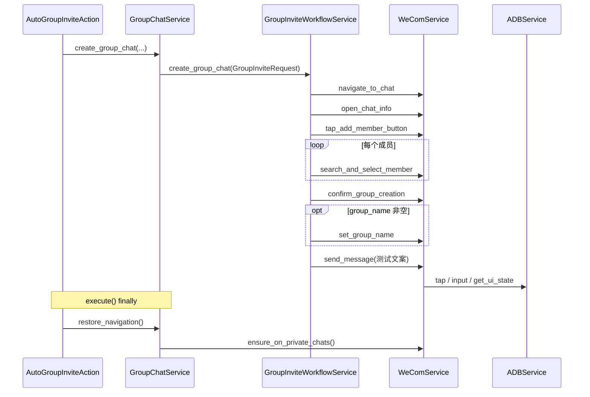

# Android 拉群工作流实现说明

> **状态**: 已实现（安卓 UI 自动化）  
> **最后更新**: 2026-04-12（与 [多机型拉群可靠性](2026-04-12-auto-group-invite-multi-device-reliability.md) 一致：`WeComService` 真机分辨率滚动缩放、拉群内 **UI 树比例阈值**、步骤重试、选择器扩展；[多分辨率与 DroidRun](../bugs/2026-04-12-multi-resolution-group-invite-and-droidrun-port-fix.md)；**实时跟进后回到私聊列表** 见 [私聊导航](../bugs/2026-04-12-auto-group-invite-private-chats-navigation.md)；`ui_parser` 弱化 resourceId 依赖）  
> 历史：2026-04-05 建群后消息模板在动作层解析；与 [2026-04-05 姊妹文档](2026-04-05-media-auto-actions-custom-message-and-chat-header-menu.md) 对齐

## 背景与目标

在客户发图/视频触发「自动拉群」或未来手动调用时，需要在安卓企业微信上完成标准流程：进入客户单聊 → 聊天信息 → 加成员 → 搜索并勾选成员 → 确认建群 → 进入群聊 → 发送测试消息。本实现强调**可复用契约**、**集中选择器**与**兼容层**，避免把 UI 细节散落在动作类里。

## 模块划分

| 层级           | 路径                                                                       | 职责                                                                                                                                                           |
| -------------- | -------------------------------------------------------------------------- | -------------------------------------------------------------------------------------------------------------------------------------------------------------- |
| 领域契约与编排 | `src/wecom_automation/services/group_invite/`                              | `GroupInviteRequest` / `GroupInviteResult`、`DuplicateNamePolicy`、`GroupInviteWorkflowService`、选择器常量 `selectors.py`                                     |
| 安卓 UI 能力   | `src/wecom_automation/services/wecom_service.py`                           | `navigate_to_chat`、`open_chat_info`、`tap_add_member_button`、`search_and_select_member`、`confirm_group_creation`、`set_group_name`（群名现为占位/后续扩展） |
| 媒体动作兼容层 | `src/wecom_automation/services/media_actions/group_chat_service.py`        | 保持 `IGroupChatService` 与 `media_action_groups` 落库；内部委托 `GroupInviteWorkflowService`                                                                  |
| 自动动作       | `src/wecom_automation/services/media_actions/actions/auto_group_invite.py` | 读取子配置并调用 `create_group_chat`（含测试消息与等待等可选参数）                                                                                             |

## 运行时序（概要）

## 实时跟进与消息列表（2026-04-12）

自动拉群成功后 UI 停在新**群聊**页。若在实时红点流程中不恢复，后续一次 `go_back()` 可能落在 **「全部」** 而非 **「私聊」**，导致 `_detect_first_page_unread` 扫错列表。

- **`GroupChatService.restore_navigation()`**：封装为对 `WeComService.ensure_on_private_chats()` 的调用。
- **`AutoGroupInviteAction.execute()`**：在 `try`/`except` 之后的 **`finally`** 中始终调用 `restore_navigation()`（建群成功、失败或异常均执行）。
- **`WeComService.ensure_on_private_chats()`**：从 `chat` 执行 `go_back()` 后重新识别屏幕；若非 `private_chats` 则调用 `switch_to_private_chats()`。

详见 [Bug 记录：自动拉群后私聊列表](../bugs/2026-04-12-auto-group-invite-private-chats-navigation.md)。

## 配置（`media_auto_actions.auto_group_invite`）

在原有 `group_members`、`group_name_template`、`skip_if_group_exists` 基础上增加（均有默认值，旧库合并后自动补齐）：

- `member_source`：`manual` | `resolved`（预留，当前仍以 `group_members` 为准）
- `send_test_message_after_create`：建群后是否发送测试消息
- `test_message_text`：默认 `测试`；可与群名模板共用占位符 `{customer_name}`、`{kefu_name}`、`{device_serial}`，在 `AutoGroupInviteAction` 中解析为最终字符串后再传入工作流（`GroupInviteWorkflowService` 不解析模板）
- `post_confirm_wait_seconds`：点击确认后的等待秒数（默认 `1.0`）
- `duplicate_name_policy`：当前仅支持 `first`（多个同名取第一个）

默认值注册于 `wecom-desktop/backend/services/settings/defaults.py`；Python 侧合并见 `settings_loader.py` 的 `DEFAULT_MEDIA_AUTO_ACTION_SETTINGS`。

## 多分辨率适配（2026-04-12）

`WeComService` 中的拉群 UI 检测原先使用 720p 硬编码像素值，在 1080p 设备上失败。修复方案：

- 新增 `_screen_width` / `_screen_height` 缓存，通过 `_update_screen_dimensions()` 从 UI 树根元素自动检测屏幕尺寸。
- `_find_add_member_entry`、`_is_image_like_click_target`、`_find_search_button`、`_find_member_result_candidates` 中的像素阈值全部改为基于屏幕宽高比例的计算。
- 已在 720×1612 和 1080×2400 两种分辨率设备上验证通过。

详见 [多分辨率拉群与端口修复](../bugs/2026-04-12-multi-resolution-group-invite-and-droidrun-port-fix.md)。

## 已知限制

1. **群名重命名**：`set_group_name` 为 best-effort 占位，不阻断建群成功；若需在 UI 上真正改名，需在 `WeComService` 中按版本补全。
2. **控件差异**：选择器以 **文案 / contentDescription / resourceId pattern** 与 **几何启发式** 为主（见 [2026-04-12 多机型说明](2026-04-12-auto-group-invite-multi-device-reliability.md)）。添加成员入口在部分版本上无文案，依赖 **屏幕比例** 回退（见 [多分辨率修复](../bugs/2026-04-12-multi-resolution-group-invite-and-droidrun-port-fix.md)）。仍建议在新 WeCom 版本上跑 `scripts/diagnose_group_invite.py` 后再按需扩展 `selectors.py` 或 `WeComService`。
3. **列表客户名匹配**：`navigate_to_chat` → `_find_user_element` 使用 **与列表行 `text` 完全一致** 的匹配。若会话里只存了短名而 UI 显示带备注后缀，需在业务层传入与列表一致的展示名。
4. **`device_serial` 参数**：工作流方法签名保留 `device_serial` 以便多设备扩展；当前实现与既有 `WeComService` 一致，主要使用配置中的设备连接。

## 测试

| 文件                                               | 覆盖点                                                                                                                                     |
| -------------------------------------------------- | ------------------------------------------------------------------------------------------------------------------------------------------ |
| `tests/unit/test_group_invite_workflow.py`         | 工作流编排、成员去重、失败分支、重命名警告                                                                                                 |
| `tests/unit/test_group_chat_service.py`            | `GroupChatService` 委托工作流与落库；`restore_navigation` 委托与异常降级                                                                   |
| `tests/unit/test_auto_group_invite_action.py`      | 动作向 `create_group_chat` 传递扩展参数、消息模板渲染；`finally` 中 `restore_navigation` 必调                                              |
| `tests/unit/test_media_actions_settings_loader.py` | 新 JSON 字段默认与合并                                                                                                                     |
| `tests/integration/test_group_invite_e2e.py`       | 完整 10 步真机流程（连接→私聊→客户→聊天信息→添加成员→搜索→选择→建群→返回），支持 `--member` 和 `--serial` 参数，已在两种分辨率设备验证通过 |

## 相关文档

- [Media Auto-Actions 功能说明](../features/media-auto-actions.md)
- [多机型 / 多分辨率自动拉群可靠性](2026-04-12-auto-group-invite-multi-device-reliability.md)
- [自定义建群后消息与聊天页菜单兼容](2026-04-05-media-auto-actions-custom-message-and-chat-header-menu.md)
- [多分辨率拉群与 DroidRun 端口修复](../bugs/2026-04-12-multi-resolution-group-invite-and-droidrun-port-fix.md)
- [自动拉群后回到私聊列表](../bugs/2026-04-12-auto-group-invite-private-chats-navigation.md)

## 维护备注

- **`python-dotenv`**：`droidrun` 在导入链中会用到 `dotenv`；已在根目录 `pyproject.toml` 的 `dependencies` 中显式声明，避免仅安装部分依赖时单测收集失败。
- **Python 3.12+ / 3.14**：若干 ADB 相关单测原先使用 `asyncio.get_event_loop().run_until_complete`，在无默认事件循环环境下会失败；已统一改为 `asyncio.run(...)`（见 `tests/unit/test_get_ui_state.py` 等文件）。
