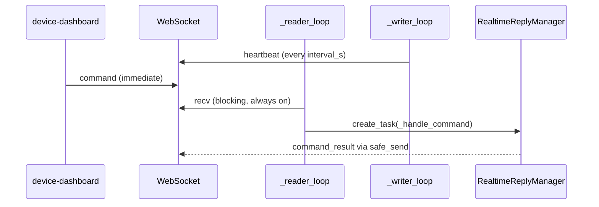

# Dashboard remote-command latency fix — 2026-05-16

## Context

The **device-dashboard** sends per-device control commands (`device_start`, `device_stop`, `device_pause`, `device_resume`, `device_restart`, `app_restart`) to the WeCom desktop client over the existing heartbeat WebSocket (`/ws/heartbeat`). The WeCom side implements this in `wecom-desktop/backend/services/heartbeat_client.py` (`HeartbeatClient`).

## Problem

Operators observed **10–15s delay** between clicking a control in the dashboard and seeing the device process start/stop in the WeCom UI.

## Architecture (after fix)

| Component | Responsibility |
| --------- | -------------- |
| `_reader_loop` | Blocking `ws.recv()`; on `type=command`, spawn `_handle_command` without blocking further reads |
| `_writer_loop` | Wait `interval_s` or event queue; send heartbeats and telemetry events |
| `safe_send` | Serialize all `ws.send()` calls (writer + command results) behind one `asyncio.Lock` |

## Files changed

| File | Change |
| ---- | ------ |
| `wecom-desktop/backend/services/heartbeat_client.py` | Reader/writer split; removed `_read_ws_response` half-duplex read-after-send |

No dashboard (`device-dashboard`) code changes were required — its `HeartbeatRegistry.send_command` already writes to the socket immediately.

## Configuration

- `HeartbeatClient.interval_s` (default **10**) still controls heartbeat **reporting** frequency only; it no longer gates command delivery.

## Tests

- `tests/unit/test_heartbeat_client_commands.py` — reader dispatches `command` without waiting for writer interval (mock WebSocket).
