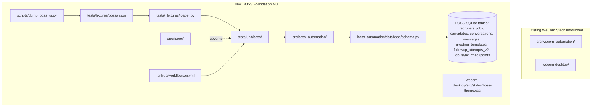

# Design - 0001 Pivot Foundation

## Context & Constraints

- Existing WeCom code is mature and shipping; we cannot break it during
  the pivot. New BOSS code lives in a separate Python package and database
  table set so legacy and new can co-exist on disk and at runtime.
- TDD is mandatory. Every behavioral change must be motivated by a failing
  test. Real-device interaction is forbidden in unit tests; we use dumped
  UI trees as fixtures.
- The user has a real BOSS Zhipin Android device available for UI dumping.
  The `scripts/dump_boss_ui.py` tool is the only sanctioned way to capture
  UI fixtures.
- The desktop app rename (`wecom-desktop` → `boss-desktop`) and Python
  package rename are deferred to M6. M0 only adds new namespaces.

## Architecture (M0 deliverables only)



## Data Model Changes

New tables only, no modifications to existing WeCom tables. All BOSS
tables live in the same SQLite file as WeCom (configurable via
`BOSS_DB_PATH` env var; defaults to `boss_recruitment.db` in project root
to keep BOSS data separate from `wecom_conversations.db`).

```sql
CREATE TABLE IF NOT EXISTS recruiters (
    id INTEGER PRIMARY KEY AUTOINCREMENT,
    device_serial TEXT UNIQUE NOT NULL,
    name TEXT,
    company TEXT,
    position TEXT,
    avatar_path TEXT,
    created_at TIMESTAMP DEFAULT CURRENT_TIMESTAMP,
    updated_at TIMESTAMP DEFAULT CURRENT_TIMESTAMP
);

CREATE TABLE IF NOT EXISTS jobs (
    id INTEGER PRIMARY KEY AUTOINCREMENT,
    recruiter_id INTEGER NOT NULL REFERENCES recruiters(id) ON DELETE CASCADE,
    boss_job_id TEXT,
    title TEXT NOT NULL,
    status TEXT NOT NULL CHECK(status IN ('open','closed','hidden','draft')),
    salary_min INTEGER,
    salary_max INTEGER,
    location TEXT,
    education TEXT,
    experience TEXT,
    last_seen_at TIMESTAMP,
    created_at TIMESTAMP DEFAULT CURRENT_TIMESTAMP,
    updated_at TIMESTAMP DEFAULT CURRENT_TIMESTAMP,
    UNIQUE(recruiter_id, boss_job_id)
);

CREATE TABLE IF NOT EXISTS candidates (
    id INTEGER PRIMARY KEY AUTOINCREMENT,
    recruiter_id INTEGER NOT NULL REFERENCES recruiters(id) ON DELETE CASCADE,
    boss_candidate_id TEXT,
    name TEXT NOT NULL,
    age INTEGER,
    gender TEXT,
    current_company TEXT,
    current_position TEXT,
    education TEXT,
    experience TEXT,
    expected_salary TEXT,
    expected_location TEXT,
    resume_text TEXT,
    resume_screenshot_path TEXT,
    source_job_id INTEGER REFERENCES jobs(id) ON DELETE SET NULL,
    status TEXT NOT NULL DEFAULT 'new'
        CHECK(status IN ('new','greeted','replied','exchanged','interviewing','hired','rejected','silent','blocked')),
    last_active_at TIMESTAMP,
    created_at TIMESTAMP DEFAULT CURRENT_TIMESTAMP,
    updated_at TIMESTAMP DEFAULT CURRENT_TIMESTAMP,
    UNIQUE(recruiter_id, boss_candidate_id)
);

CREATE TABLE IF NOT EXISTS conversations (
    id INTEGER PRIMARY KEY AUTOINCREMENT,
    recruiter_id INTEGER NOT NULL REFERENCES recruiters(id) ON DELETE CASCADE,
    candidate_id INTEGER NOT NULL REFERENCES candidates(id) ON DELETE CASCADE,
    job_id INTEGER REFERENCES jobs(id) ON DELETE SET NULL,
    last_message_at TIMESTAMP,
    last_direction TEXT CHECK(last_direction IN ('in','out')),
    unread_count INTEGER NOT NULL DEFAULT 0,
    created_at TIMESTAMP DEFAULT CURRENT_TIMESTAMP,
    updated_at TIMESTAMP DEFAULT CURRENT_TIMESTAMP,
    UNIQUE(recruiter_id, candidate_id)
);

CREATE TABLE IF NOT EXISTS messages (
    id INTEGER PRIMARY KEY AUTOINCREMENT,
    conversation_id INTEGER NOT NULL REFERENCES conversations(id) ON DELETE CASCADE,
    direction TEXT NOT NULL CHECK(direction IN ('in','out')),
    content_type TEXT NOT NULL DEFAULT 'text'
        CHECK(content_type IN ('text','image','resume','exchange_request','interview','system','voice','file')),
    text TEXT,
    raw_payload TEXT,
    sent_at TIMESTAMP NOT NULL,
    sent_by TEXT CHECK(sent_by IN ('manual','auto','template','ai')),
    template_id INTEGER REFERENCES greeting_templates(id) ON DELETE SET NULL,
    message_hash TEXT UNIQUE NOT NULL,
    created_at TIMESTAMP DEFAULT CURRENT_TIMESTAMP
);

CREATE TABLE IF NOT EXISTS greeting_templates (
    id INTEGER PRIMARY KEY AUTOINCREMENT,
    name TEXT NOT NULL,
    scenario TEXT NOT NULL CHECK(scenario IN ('first_greet','reply','reengage')),
    content TEXT NOT NULL,
    variables_json TEXT,
    is_default BOOLEAN NOT NULL DEFAULT 0,
    created_at TIMESTAMP DEFAULT CURRENT_TIMESTAMP,
    updated_at TIMESTAMP DEFAULT CURRENT_TIMESTAMP,
    UNIQUE(name, scenario)
);

CREATE TABLE IF NOT EXISTS followup_attempts_v2 (
    id INTEGER PRIMARY KEY AUTOINCREMENT,
    candidate_id INTEGER NOT NULL REFERENCES candidates(id) ON DELETE CASCADE,
    conversation_id INTEGER REFERENCES conversations(id) ON DELETE SET NULL,
    scheduled_at TIMESTAMP NOT NULL,
    sent_at TIMESTAMP,
    template_id INTEGER REFERENCES greeting_templates(id) ON DELETE SET NULL,
    status TEXT NOT NULL DEFAULT 'pending'
        CHECK(status IN ('pending','sent','cancelled','failed')),
    reason TEXT,
    created_at TIMESTAMP DEFAULT CURRENT_TIMESTAMP,
    updated_at TIMESTAMP DEFAULT CURRENT_TIMESTAMP
);

CREATE TABLE IF NOT EXISTS job_sync_checkpoints (
    id INTEGER PRIMARY KEY AUTOINCREMENT,
    recruiter_id INTEGER NOT NULL REFERENCES recruiters(id) ON DELETE CASCADE,
    last_synced_at TIMESTAMP,
    last_cursor TEXT,
    payload_json TEXT,
    created_at TIMESTAMP DEFAULT CURRENT_TIMESTAMP,
    updated_at TIMESTAMP DEFAULT CURRENT_TIMESTAMP,
    UNIQUE(recruiter_id)
);

CREATE TABLE IF NOT EXISTS boss_schema_version (
    version INTEGER PRIMARY KEY,
    applied_at TIMESTAMP DEFAULT CURRENT_TIMESTAMP
);
```

Migration policy: idempotent `CREATE TABLE IF NOT EXISTS` plus
column-presence checks (mirroring the existing `BLACKLIST_COLUMN_REPAIRS`
pattern in `src/wecom_automation/database/schema.py`). Version starts at
`1` for M0; every milestone that changes the schema bumps it.

## Error Handling & Safety

- `ensure_schema()` MUST be idempotent: running it twice on the same
  database is a no-op.
- The dump tool MUST refuse to overwrite existing fixtures unless
  `--force` is passed; this prevents accidental loss of curated test data.
- The fixture loader MUST validate the JSON envelope shape and raise a
  precise `FixtureError` with the offending file path on malformed input.
  This protects test signal-to-noise.

## Testing Strategy

| Layer | What | Where | Mocks |
|-------|------|-------|-------|
| schema | tables created, idempotency, version row | tests/unit/boss/test_boss_schema.py | sqlite in-memory |
| loader | shape validation, missing file, version field | tests/unit/boss/test_fixture_loader.py | tmp_path |
| dump tool | (deferred to M1 integration) | tests/integration/ | real device |

## Risks & Mitigations

- Risk: BOSS app obfuscates accessibility tree → **Mitigation**: M0 dump
  tool also captures a screenshot, so we can fall back to OCR + screen
  coordinates in M1 if needed. Captured in design doc note.
- Risk: Two SQLite files (wecom + boss) cause confusion → **Mitigation**:
  `BOSS_DB_PATH` defaults are explicit and documented; CLAUDE.md update
  in commit c spells this out.
- Risk: Tests in `wecom-desktop/backend/tests/` are not picked up by root
  pytest → **Mitigation**: Phase 2 includes adding the path to
  `pyproject.toml` testpaths.
