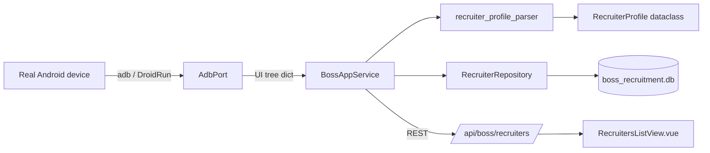

# Design - 0002 Recruiter Bootstrap

## Context

The BOSS Zhipin Android app has a typical Android navigation: bottom
tabs ("首页", "招聘", "消息", "我"), a top toolbar, and pages that load
recruiter identity from server. The "我" tab shows the recruiter's
name, company, position, and avatar.

Without a real device dump in this commit cycle, M1 fixtures are
**synthetic but realistic**: they use plausible BOSS resource IDs
(`com.hpbr.bosszhipin:id/...`) and the standard accessibility tree
shape. When the user runs `scripts/dump_boss_ui.py` against a real
device, those fixtures are replaced via `--force` and the parser tests
re-run unchanged. The contract this change pins is:

- A "logged in" home tree always contains at least one element with a
  bottom-tab content description matching one of the four expected
  tabs.
- A "logged out" tree always contains an element whose text matches a
  set of known login-screen labels ("登录", "Login").
- A "我" profile tree always contains a name TextView at a deterministic
  resource id, optionally followed by company and position TextViews.

If the real BOSS app uses different resource IDs, only the parser's
selector tuples need updating; the test structure does not change.

## Architecture



## Data Model

The schema for `recruiters` was created in M0 (0001). M1 only adds a
repository layer:

```python
@dataclass(frozen=True, slots=True)
class RecruiterProfile:
    name: str
    company: str | None = None
    position: str | None = None
    avatar_path: str | None = None


class RecruiterRepository:
    def __init__(self, db_path: str | Path) -> None: ...
    def upsert(self, device_serial: str, profile: RecruiterProfile) -> int: ...
    def get_by_serial(self, device_serial: str) -> RecruiterProfile | None: ...
    def list_all(self) -> list[tuple[str, RecruiterProfile]]: ...
```

## ADB Port (testability seam)

The service should not import `wecom_automation.services.adb_service`
directly because (a) it pulls in DroidRun at import time and (b) the
ADBService is being decoupled from WeCom in later milestones. Instead,
M1 introduces a tiny **Protocol**:

```python
class AdbPort(Protocol):
    async def start_app(self, package_name: str) -> None: ...
    async def get_state(self) -> tuple[dict, list[dict]]: ...
    async def tap_by_text(self, text: str) -> bool: ...
```

The production implementation will wrap `wecom_automation.services
.adb_service.ADBService`. Unit tests pass a fake. This makes the
service unit-testable without monkey-patching DroidRun globally.

## Error Handling

- If the parser cannot find a name TextView in the "我" tree, it
  returns `None`. The service treats `None` as "not yet logged in" and
  surfaces a typed `LoginRequiredError`.
- The repository upsert is transactional and idempotent on
  `device_serial` (UNIQUE constraint from M0).

## Test Strategy

| Layer | What | Where | Mocks |
|-------|------|-------|-------|
| Parser | logged-in detection, profile extraction, missing-field tolerance | tests/unit/boss/parsers/ | none |
| Repository | upsert idempotency, list, get | tests/unit/boss/test_recruiter_repository.py | tmp sqlite |
| Service | launch, polling, login-required flow, profile fetch happy path | tests/unit/boss/services/test_boss_app_service.py | FakeAdbPort |
| Router | GET / POST happy path, 404 unknown serial | wecom-desktop/backend/tests/test_boss_recruiters_api.py | mocked service |
| Frontend store | fetch, refresh, error | wecom-desktop/src/stores/bossRecruiters.spec.ts | mocked fetch |
| View | empty state, populated state | wecom-desktop/src/views/boss/RecruitersListView.spec.ts | mocked store |
| Integration | full real-device flow | tests/integration/ | real device, skipped CI |

## Risks

- BOSS resource IDs might differ from synthetic fixtures. Mitigation:
  parser selector lists are short, configurable arrays at the top of
  the module. A single re-dump + edit fixes drift.
- The frontend view assumes a single recruiter per device (matches
  product). If a device hosts multiple BOSS accounts, the design needs
  revisiting; out of scope for M1 by explicit decision.
