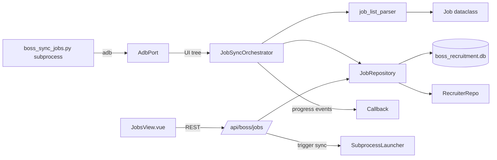

# Design - 0003 Job Sync

## Architecture



## Job Dataclass

```python
@dataclass(frozen=True, slots=True)
class Job:
    boss_job_id: str           # extracted from card content / id badge
    title: str
    status: JobStatus          # 'open' | 'closed' | 'hidden' | 'draft'
    salary_min: int | None     # parsed from salary range string
    salary_max: int | None
    location: str | None
    education: str | None
    experience: str | None
```

## Orchestrator Contract

```python
async def sync_jobs(
    self,
    recruiter_id: int,
    *,
    tabs: Sequence[JobStatus] = (JobStatus.OPEN, JobStatus.CLOSED),
    progress: Callable[[JobSyncProgress], None] | None = None,
) -> JobSyncResult: ...
```

- Open / closed tabs are always visited; hidden / draft are opt-in.
- For each tab: navigate by tap → poll get_state → if UI tree hash
  unchanged for `stable_threshold` consecutive scrolls, stop scrolling
  and finalize that tab.
- Persists per-tab; a tab failure does not block other tabs.
- Returns a `JobSyncResult(open_count, closed_count, hidden_count,
  errors)`.

## Subprocess Script

`wecom-desktop/backend/scripts/boss_sync_jobs.py`:

```
uv run wecom-desktop/backend/scripts/boss_sync_jobs.py \
    --serial <SERIAL> \
    --recruiter-id <ID> \
    --tabs open,closed \
    --tcp-port 8080
```

Logs go to stdout (captured by `DeviceManager` in M6). Exit codes:
- 0 success
- 2 invalid arguments
- 3 device unreachable
- 4 partial success (some tabs failed)

## Backend Routes

```
GET    /api/boss/jobs?recruiter_id={id}&status={open|closed|hidden}
GET    /api/boss/jobs/{job_id}
POST   /api/boss/jobs/sync   { device_serial, tabs?: [...] }
```

The `POST /sync` endpoint synchronously invokes the orchestrator on a
provided AdbPort for unit tests; production wiring (real subprocess
spawn via DeviceManager) lands in M6.

## Risks

- BOSS resource IDs for the job list tabs are unknown until the user
  dumps a real fixture. Synthetic fixtures use plausible IDs; selectors
  in the parser are short tuples ready for one-line replacement.
- Pagination triggers may differ across BOSS app versions. The
  orchestrator does not assume any particular trigger; it simply
  scrolls until UI is stable.
