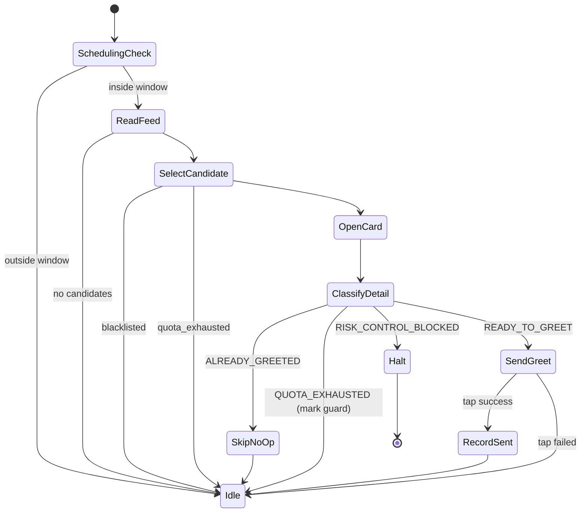

# Design - 0004 Greet Candidates

## Context

The greet flow is a tight loop with several failure modes that MUST
NOT be retried. Most of the work is therefore in the *detector*
(safely classify what the device is showing) and the *guard rails*
(quota, schedule, blacklist), not in the orchestration of taps.

## State Machine



## Quota Model

Quotas are read from the `messages` table joined to `candidates` so
the guard reflects ground truth (DB messages == greetings actually
sent). Three knobs:

```python
@dataclass(frozen=True)
class GreetQuota:
    per_day: int          # default 80
    per_hour: int         # default 15
    per_job: int | None   # optional cap per source job, default None
```

Decisions are computed lazily; we do NOT pre-emptively reserve a
slot. After a send, the guard re-reads from the DB. This avoids
double-counting if two processes race (M6 will add a process-level
mutex).

## Schedule

```python
@dataclass(frozen=True)
class GreetSchedule:
    weekday_mask: int   # bit 0 = Monday … bit 6 = Sunday
    start_minute: int   # 0..1439, minutes since midnight local time
    end_minute: int     # 0..1439, exclusive
    timezone: str       # IANA name (default Asia/Shanghai)

def is_within_window(schedule: GreetSchedule, now: datetime) -> bool: ...
```

Cross-midnight semantics: when `end_minute < start_minute` the window
spans midnight. The check evaluates BOTH days' weekday_mask and
returns true if either side accepts the current local time.

## Greet Executor Contract

```python
async def execute_one(
    self,
    recruiter: RecruiterContext,
    *,
    is_blacklisted: Callable[[str], Awaitable[bool]] | None = None,
    progress: Callable[[GreetEvent], None] | None = None,
) -> GreetOutcome: ...
```

`execute_one` performs ONE greet attempt: pick the next eligible
candidate from the feed, classify, send (or skip), and record.
`run_until_quota_or_halt(...)` is a thin loop wrapper for the desktop
app to consume.

`GreetOutcome` is a dataclass with one of:
- `SENT(candidate_id, message_hash)`
- `SKIPPED_ALREADY_GREETED(candidate_id)`
- `SKIPPED_BLACKLISTED(candidate_id)`
- `SKIPPED_QUOTA_DAY` / `SKIPPED_QUOTA_HOUR` / `SKIPPED_QUOTA_JOB`
- `SKIPPED_OUTSIDE_WINDOW`
- `HALTED_RISK_CONTROL`
- `HALTED_UNKNOWN_UI(snapshot_path)`

## Risk-Control Detection

The detector recognises BOSS risk-control popups by their well-known
button labels ("我知道了", "去申诉") plus a title regex
("操作过于频繁|访问异常|账号异常"). Once any one element matches,
the executor halts and records `HALTED_RISK_CONTROL`. The desktop UI
uses this to flip the schedule into a paused state and surface a
toast to the operator.

## Blacklist Safety

- Identity is `(recruiter_id, boss_candidate_id)` matching M0 schema.
- Blacklist check happens TWICE: once when picking from the feed
  (cheap, before opening the card), and once *immediately* before
  the 立即沟通 tap. The second check exists to defeat mid-flight
  state changes per the AGENTS.md blacklist send-safety rules.
- A test asserts both checks happen for a candidate that is
  whitelisted at pick time and blacklisted before the second check.

## Test Strategy

- All parser/detector tests use synthetic UI fixtures.
- Quota guard / schedule tests are pure-Python; no fixtures needed.
- Executor tests use a `FakeAdbPort` that returns scripted UI trees
  per call, plus a `FakeBlacklistChecker`, plus an in-memory DB.
  Every state-machine branch has its own happy-path test.
- One regression test exercises the mid-flight blacklist scenario
  to satisfy the AGENTS.md blacklist guardrail.

## Risks

- The candidate feed UI changes between BOSS app versions; selectors
  in `candidate_card_parser.py` are short tuples mirroring the M2
  job-list parser pattern so a single line of editing covers it.
- Quota counting from `messages` is approximate within the same
  second. We accept this trade-off since the per-hour cap is the
  binding constraint, not a per-second one.
