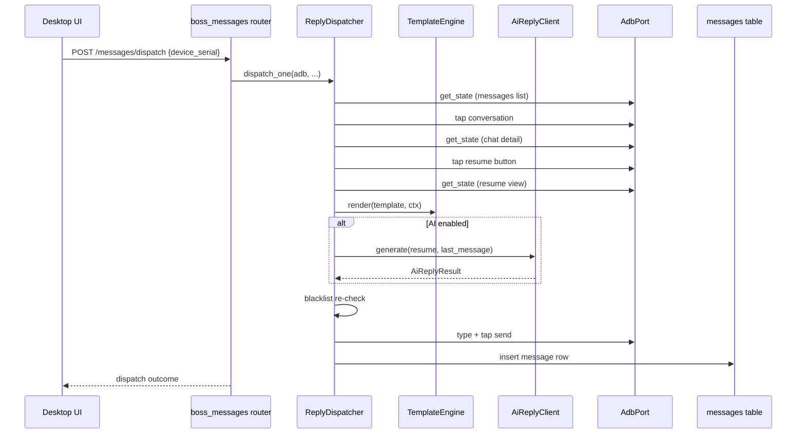

# Design - 0005 Message Reply

## Reply Flow



## Template Engine Syntax

- `{name}` substitutes the candidate's name.
- `{position}` substitutes their applied job title.
- `{company}` substitutes the recruiter's company name.
- `{?expected_salary: 你期望的薪资是 {expected_salary}，刚好匹配。}`
  is a conditional segment: only emitted when `expected_salary` is
  truthy. The body itself supports nested simple placeholders.
- Unknown placeholders are left as-is and a warning is collected,
  never raises.

## AI Client Contract

```python
@dataclass(frozen=True)
class AiReplyResult:
    kind: AiReplyKind  # SUCCESS|TIMEOUT|HTTP_ERROR|EMPTY|CIRCUIT_OPEN
    text: str | None
    detail: str | None

async def generate(
    self,
    *,
    candidate_name: str,
    resume_summary: str | None,
    last_message: str,
    timeout_s: float = 10.0,
) -> AiReplyResult: ...
```

The client owns its own circuit breaker (3 consecutive timeouts →
open for 60s). The dispatcher checks `result.kind` and, on any
non-success, falls back to the configured template.

## Dispatcher Contract

```python
@dataclass(frozen=True)
class DispatchOutcome:
    kind: DispatchKind  # SENT_TEMPLATE|SENT_AI|SKIPPED_*|HALTED_*
    boss_candidate_id: str | None
    template_id: int | None
    text_sent: str | None

async def dispatch_one(
    self,
    *,
    is_blacklisted: Callable[[str], Awaitable[bool]] | None = None,
    progress: Callable[[DispatchEvent], None] | None = None,
) -> DispatchOutcome: ...
```

Picks the first conversation where `unread_count > 0` from the
parsed messages list. If `is_blacklisted` returns True at pick or
right before send, the dispatch is cancelled (AGENTS.md guardrail).

## Template Storage

The `greeting_templates` table from M0 is used as-is. Templates have
a `scenario` enum (`first_greet | reply | reengage`); M4 only writes
`reply` scenario rows but the table is shared with M3 and M5.

## Risks

- BOSS chat composer requires ADB IME-friendly text input. The
  dispatcher uses a "type → tap send" sequence; on devices where
  type fails the test-run will report HALTED_UNKNOWN_UI.
- AI server may return very long text that doesn't fit in the BOSS
  message limit (~500 chars). The dispatcher truncates at 480 chars
  with ellipsis to leave room for line breaks.
